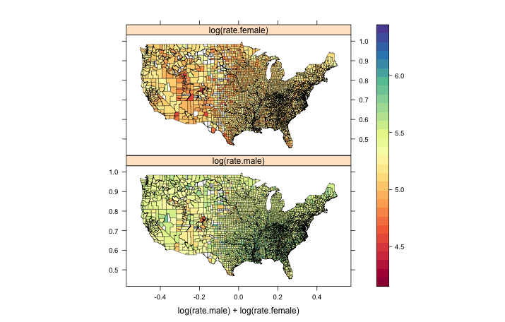

Geospatial data input/output, manipulation, and vizualization are tasks that are common to many disciplines. Thus, we're keenly interested in making great tools

## rOpenSci Geospatial tools

We have an increasing set of spatial tools for R:

### geojsonio

[geojsonio](https://github.com/ropensci/geojsonio) - A tool for converting to and from geojson data. For example:


```r
library("geojsonio")
'xxx'
#> [1] "xxx"
```

### wellknown

[wellknown](https://github.com/ropensci/wellknown) - A tool for converting to and from well-known text data. For example:


```r
library("wellknown")
'xxx'
#> [1] "xxx"
```

### cartographer

[cartographer](https://github.com/ropensci/cartographer) - xxdasfaff. For example:


```r
library("cartographer")
'xxx'
#> [1] "xxx"
```

### gistr

[gistr](https://github.com/ropensci/gistr) - This is not a geospatial tool per se, but it's extremely useful for sharing maps. For example, with just a few lines, you can share an interactive map to GitHub.


```r
library("gistr")
'xxx'
#> [1] "xxx"
```

### lawn

An R client for [turf.js](http://turfjs.org/).


```r
library("lawn")
'xxx'
#> [1] "xxx"
```

### proj

An R client for [proj4js](https://github.com/proj4js/proj4js), a Javascript library for projections.

Main features:

* x
* y
* z

### Javascript

We plan to help bring into R many geospatial analysis tools from Javascript by creating interfaces to them via [V8](https://github.com/jeroenooms/V8/). One good reason for this is that rgdal/rgeos can be a pain to install on some operating systems because the C libraries they depend on have to compile - whereas that isn't required for Javascript libraries. Speed is one consideration in thinking about depending on a C/C++ library vs. a Javascript library - but some may rather give up a little speed for ease of installation. 

## Maptools Task View

Jeff Hollister is leading the maptools task view, to organize knowledge around mapping tools, including for sources of data, projections, static and interactive mapping, data transformation, and more. 

More from Jeff?

## Maps in R

The increasing number of mapping packages in R is great, but it can make it more difficult to know what mapping package to use. The main breakdown may be between those that make static maps and those that make interactive maps. What's the best package for data exploration? For interactive online maps? For publication quality maps? For sharing maps with friends or colleagues? 

### Static maps

* base R, `plot.Spatial()` in [sp](http://cran.r-project.org/web/packages/sp/index.html), [quickmapr](https://github.com/jhollist/quickmapr)
* [latticeExtra](http://cran.r-project.org/web/packages/latticeExtra/index.html)
* ggplot2 [e.g. 1](http://spatial.ly/2013/12/introduction-spatial-data-ggplot2/) [e.g. 2](http://www.unomaha.edu/mahbubulmajumder/data-science/fall-2014/lectures/06-display-spatial-data/06-display-spatial-data.html), [micromap](https://github.com/USEPA/R-micromap-package-development)
* static versions of google maps, etc. via [ggmap](https://github.com/dkahle/ggmap), [RgoogleMaps](https://github.com/markusloecher/RgoogleMaps)

Data formats:

Examples:

____


```r
library("maps")
library("mapproj")
library("latticeExtra")
data(USCancerRates)
suppressWarnings(print(
  mapplot(rownames(USCancerRates) ~ log(rate.male) + log(rate.female),
          data = USCancerRates,
          map = map("county", plot = FALSE, fill = TRUE,
                    projection = "mercator"))
))
```



### Interactive maps

* [leaflet](http://rstudio.github.io/leaflet/)
* [rMaps](https://github.com/ramnathv/rMaps)
* [cartographer](https://github.com/lmullen/cartographer)
* [plotly](https://github.com/ropensci/plotly)
* [leafletR](https://github.com/chgrl/leafletR)

Data formats:

| Package      | Data Format                     | Example                       |
|--------------|---------------------------------|-------------------------------|
| leaflet      | many^1                          |                               |
| rMaps        | data.frame                      |                               |
| cartographer | data.frame, geojson, topojson^2 | https://github.com/ropensci/cartographer#basic-use |
| plotly       | data.frame                      | https://plot.ly/ggplot2/maps/ |
| leafletR     | geojson, topojson^2             |                               |

^1: matrix, data.frame, SpatialPoints(DataFrame), Line/Lines, SpatialLines(DataFrame), Polygon/Polygons, SpatialPolygons(DataFrame), maps package data, geojson
^2: includes tools to help convert Spatial objects data
