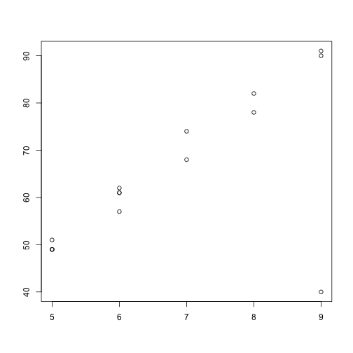
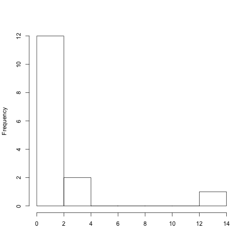
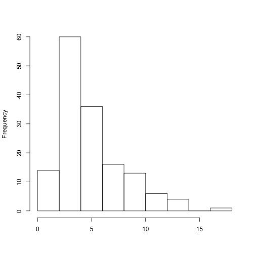
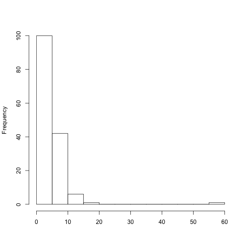

In data analysis workflows that depend on un-sanitized data sets from external
sources, it’s very common that errors in data bring an analysis to a
screeching halt. Oftentimes, these errors occur late in the analysis and
provide no clear indication of which datum caused the error.

On occasion, the error resulting from bad data won’t even appear to be a
data error at all. Still worse, errors in data will pass through analysis
without error, remain undetected, and produce inaccurate results.

The solution to the problem is to provide as much information as you can about
how you expect the data to look up front so that any deviation from this
expectation can be dealt with immediately. This is what the `assertr` package
tries to make dead simple.

Essentially, `assertr` provides a suite of functions designed to verify
assumptions about data early in an analysis pipeline. This package needn't
be used with the `magrittr`/`dplyr` piping mechanism but the examples in this
vignette will use them to enhance clarity.


<section id="installation">

## Installation

Stable version from CRAN


```r
install.packages("assertr")
```

Development version from GitHub


```r
if (!require("devtools")) install.packages("devtools")
devtools::install_github("ropenscilabs/assertr")
```


```r
library("assertr")
```

<section id="usage">

## Usage


### concrete data errors

Let’s say, for example, that the R’s built-in car dataset, `mtcars`, was not
built-in but rather procured from an external source that was known for making
errors in data entry or coding.

In particular, the mtcars dataset looks like this:


```r
head(mtcars)
#>                    mpg cyl disp  hp drat    wt  qsec vs am gear carb
#> Mazda RX4         21.0   6  160 110 3.90 2.620 16.46  0  1    4    4
#> Mazda RX4 Wag     21.0   6  160 110 3.90 2.875 17.02  0  1    4    4
#> Datsun 710        22.8   4  108  93 3.85 2.320 18.61  1  1    4    1
#> Hornet 4 Drive    21.4   6  258 110 3.08 3.215 19.44  1  0    3    1
#> Hornet Sportabout 18.7   8  360 175 3.15 3.440 17.02  0  0    3    2
#> Valiant           18.1   6  225 105 2.76 3.460 20.22  1  0    3    1
```

But let's pretend that the data we got accidentally negated the 5th mpg value:


```r
our.data <- mtcars
our.data$mpg[5] <- our.data$mpg[5] * -1
our.data[4:6,]
#>                     mpg cyl disp  hp drat    wt  qsec vs am gear carb
#> Hornet 4 Drive     21.4   6  258 110 3.08 3.215 19.44  1  0    3    1
#> Hornet Sportabout -18.7   8  360 175 3.15 3.440 17.02  0  0    3    2
#> Valiant            18.1   6  225 105 2.76 3.460 20.22  1  0    3    1
```

Whoops!

If we wanted to find the average miles per gallon for each number of engine
cylinders, we might do so like this:


```r
library(dplyr)

our.data %>%
  group_by(cyl) %>%
  summarise(avg.mpg=mean(mpg))
#> # A tibble: 3 × 2
#>     cyl  avg.mpg
#>   <dbl>    <dbl>
#> 1     4 26.66364
#> 2     6 19.74286
#> 3     8 12.42857
```

This indicates that the average miles per gallon for a 8 cylinder car is a lowly
12.43. However, in the correct dataset it's really just over 15. Data errors
like that are extremely easy to miss because it doesn't cause an error, and the
results look reasonable.

### enter assertr

To combat this, we might want to use assertr's `verify` function to make sure
that `mpg` is a positive number:


```r
library(assertr)

our.data %>%
  verify(mpg >= 0) %>%
  group_by(cyl) %>%
  summarise(avg.mpg=mean(mpg))
#> Error in verify(., mpg >= 0): verification failed! (1 failure)
```

If we had done this, we would have caught this data error.

The `verify` function takes a data frame (its first argument is provided by
the `%>%` operator), and a logical (boolean) expression. Then, `verify`
evaluates that expression using the scope of the provided data frame. If any
of the logical values of the expression's result are `FALSE`, `verify` will
raise an error that terminates any further processing of the pipeline.

We could have also written this assertion using `assertr`'s `assert` function...


```r
our.data %>%
  assert(within_bounds(0,Inf), mpg) %>%
  group_by(cyl) %>%
  summarise(avg.mpg=mean(mpg))
#> Error: 
#> Vector 'mpg' violates assertion 'within_bounds' 1 time (value [-18.7] at index 5)
```

The `assert` function takes a data frame, a predicate function, and an arbitrary
number of columns to apply the predicate function to. The predicate function
(a function that returns a logical/boolean value) is then applied to every
element of the columns selected, and will raise an error when if it finds
violations.

Internally, the `assert` function uses `dplyr`'s `select` function to extract
the columns to test the predicate function on. This allows for complex
assertions. Let's say we wanted to make sure that all values in the dataset
are *greater* than zero (except `mpg`):


```r
our.data %>%
  assert(within_bounds(0,Inf, include.lower=FALSE), -mpg) %>%
  group_by(cyl) %>%
  summarise(avg.mpg=mean(mpg))
#> Error: 
#> Vector 'vs' violates assertion 'within_bounds' 18 times (e.g. [0] at index 1)
#> Vector 'am' violates assertion 'within_bounds' 19 times (e.g. [0] at index 4)
```

### verify vs. assert

The first noticable difference between `verify` and `assert` is that `verify`
takes an expression, and `assert` takes a predicate and columns to apply it to.
This might make the `verify` function look more elegant--but there's an
important drawback. `verify` has to evaluate the entire expression first, and
*then* check if there were any violations. Because of this, `verify` can't
tell you the offending datum.

One important drawback to `assert`, and a consequence of its application of
the predicate to *columns*, is that `assert` can't confirm assertions about
the data structure *itself*. For example, let's say we were reading a dataset
from disk that we know has more than 100 observations; we could write a check
of that assumption like this:


```r
dat <- read.csv("a-data-file.csv")
dat %>%
  verify(nrow(.) > 100) %>%
  ....
```

This is a powerful advantage over `assert`... but `assert` has one more
advantage of its own that we heretofore ignored.

### assertr's predicates

`assertr`'s predicates, both built-in and custom, make `assert` very powerful.
The three predicates that are built in to `assertr` are

- `not_na` - that checks if an element is not NA
- `within_bounds` - that returns a predicate function that checks if a numeric
value falls within the bounds supplied, and
- `in_set` - that returns a predicate function that checks if an element is
a member of the set supplied.

We've already seen `within_bounds` in action... let's use the `in_set` function
to make sure that there are only 0s and 1s (automatic and manual, respectively)
values in the `am` column...


```r
our.data %>%
  assert(in_set(0,1), am) %>%
  ...
```

If we were reading a dataset that contained a column representing boroughs of
New York City (named `BORO`), we can verify that there are no mis-spelled
or otherwise unexpected boroughs like so...


```r
boroughs <- c("Bronx", "Manhattan", "Queens", "Brooklyn", "Staten Island")

read.csv("a-dataset.csv") %>%
  assert(in_set(boroughs), BORO) %>%
  ...
```

Rad!

### custom predicates

A convenient feature of `assertr` is that it makes the construction of custom
predicate functions easy.

In order to make a custom predicate, you only have to specify cases where the
predicate should return FALSE. Let's say that a dataset has an ID column
(named `ID`) that we want to check is not an empty string. We can create a
predicate like this:


```r
not.empty.p <- function(x) if(x=="") return(FALSE)
```

and apply it like this:


```r
read.csv("another-dataset.csv") %>%
  assert(not.empty.p, ID) %>%
  ...
```

Let's say that the ID column is always a 7-digit number. We can confirm that
all the IDs are 7-digits by defining the following predicate:


```r
seven.digit.p <- function(x) nchar(x)==7
```

A powerful consequence of this easy creation of predicates is that the
`assert` function lends itself to use with lambda predicates (unnamed
predicates that are only used once). The check above might be better written as


```r
read.csv("another-dataset.csv") %>%
  assert(function(x) nchar(x)==7, ID) %>%
  ...
```

Neat-o!


### enter `insist` and predicate 'generators'

Very often, there is a need to dynamically determine the predicate function
to be used based on the vector being checked.

For example, to check to see if every element of a vector is within _n_
standard deviations of the mean, you need to create a `within_bounds`
predicate _after_ dynamically determining the bounds by reading and computing
on the vector itself.

To this end, the `assert` function is no good; it just applies a raw predicate
to a vector. We need a function like `assert` that will apply predicate
_generators_ to vectors, return predicates, and _then_ perform `assert`-like
functionality by checking each element of the vectors with its respective custom
predicate. This is precisely what `insist` does.

This is all much simpler than it may sound. Hopefully, the examples will clear
up any confusion.

The primary use case for `insist` is in conjunction with the `within_n_sds` or
`within_n_mads` predicate generator.

Suppose we wanted to check that every `mpg` value in the `mtcars` data set was
within 3 standard deviations of the mean before finding the average miles
per gallon for each number of engine cylinders. We could write something
like this:


```r

mtcars %>%
  insist(within_n_sds(3), mpg) %>%
  group_by(cyl) %>%
  summarise(avg.mpg=mean(mpg))
#> # A tibble: 3 × 2
#>     cyl  avg.mpg
#>   <dbl>    <dbl>
#> 1     4 26.66364
#> 2     6 19.74286
#> 3     8 15.10000
```

Notice what happens when we drop that z-score to 2 stardard deviations
from the mean


```r
mtcars %>%
  insist(within_n_sds(2), mpg) %>%
  group_by(cyl) %>%
  summarise(avg.mpg=mean(mpg))
#> Error: 
#> Vector 'mpg' violates assertion 'within_n_sds' 2 times (e.g. [32.4] at index 18)
```

Execution of the pipeline was halted. But now we know exactly which data point
(and column) violated the predicate that `within_n_sds(3)(mtcars$mpg)`
returned.

Now that's an efficient car!

After the predicate generator, `insist` takes an arbitrary number of columns
just like `assert` using the syntax of `dplyr`'s `select` function. If you
wanted to check that everything in mtcars is within 10 standard deviations
of the mean (of each column vector), you can do so like this:


```r
mtcars %>%
  insist(within_n_sds(10), mpg:carb) %>%
  group_by(cyl) %>%
  summarise(avg.mpg=mean(mpg))
#> # A tibble: 3 × 2
#>     cyl  avg.mpg
#>   <dbl>    <dbl>
#> 1     4 26.66364
#> 2     6 19.74286
#> 3     8 15.10000
```

Aces!

I chose to use `within_n_sds` in this example because people are familiar
z-scores. However, for most practical purposes, the related predicate generator
`within_n_mads` is more useful.

The problem with `within_n_sds` is the mean and standard deviation are so
heavily influenced by outliers, their very presence will compromise attempts
to identify them using these statistics. In contrast with `within_n_sds`,
`within_n_mads` uses the robust statistics, median and median absolute
deviation, to identify potentially erroneous data points.

For example, the vector `<7.4, 7.1, 7.2, 72.1>` almost certainly has an erroneous
data point, but `within_n_sds(2)` will fail to detect it.


```r
example.vector <- c(7.4, 7.1, 7.2, 72.1)
within_n_sds(2)(example.vector)(example.vector)
#> [1] TRUE TRUE TRUE TRUE
```

whereas `within_n_mads` will detect it at even lower levels of power....


```r
example.vector <- c(7.4, 7.1, 7.2, 72.1)
within_n_mads(2)(example.vector)(example.vector)
#> [1]  TRUE  TRUE  TRUE FALSE
within_n_mads(1)(example.vector)(example.vector)
#> [1]  TRUE  TRUE  TRUE FALSE
```

Tubular!


### row-wise assertions and row reduction functions

As cool as it's been so far, this still isn't enough to consitute a complete
grammar of data integrity checking. To see why, check out the following
small example data set:


```r
example.data <- data.frame(x=c(8, 9, 6, 5, 9, 5, 6, 7,
                             8, 9, 6, 5, 5, 6, 7),
                         y=c(82, 91, 61, 49, 40, 49, 57,
                             74, 78, 90, 61, 49, 51, 62, 68))
(example.data)
#>    x  y
#> 1  8 82
#> 2  9 91
#> 3  6 61
#> 4  5 49
#> 5  9 40
#> 6  5 49
#> 7  6 57
#> 8  7 74
#> 9  8 78
#> 10 9 90
#> 11 6 61
#> 12 5 49
#> 13 5 51
#> 14 6 62
#> 15 7 68
```

Can you spot the brazen outlier? You're certainly not going to find it by
checking the distribution of each *column*! All elements from both columns are
within 2 standard deviations of their respective means.

Unless you have a *really* good eye, the only way you're going to catch this
mistake is by plotting the data set.


```r
plot(example.data$x, example.data$y, xlab="", ylab="")
```



Ok, so all the `y`s are roughly 10 times the `x`s except the outlying data
point.

The problem having to plot data sets to catch anomalies is that it is *really*
hard to visualize 4-dimensions at once, and it is near impossible with
high-dimensional data.

There's no way of catching this anomaly by looking at each individual
column separately; the only way to catch it is to view each row as a complete
observation and compare it to the rest.

To this end, `assertr` provides two functions that take a data frame, and
reduce each row into a single value. We'll call them *row reduction functions*.

The first one we'll look at is called `maha_dist`. It computes the average
mahalanobis distance (kind of like multivariate z-scoring for outlier
detection) of each row from the whole data set. The big idea is that in the
resultant vector, big/distant values are potential anomalous entries. Let's
look at the distribution of mahalanobis distances for this data set...


```r
maha_dist(example.data)
#>  [1]  1.28106379  3.10992407  0.25081851  1.35993969 12.81898913
#>  [6]  1.35993969  0.26181283  0.47714597  0.87804987  2.95741956
#> [11]  0.25081851  1.35993969  1.29208587  0.28235776  0.05969507

maha_dist(example.data) %>% hist(main="", xlab="")
```



There's no question here as to whether there's an anomalous entry! But how do
you check for this sort of thing using `assertr` constructs?

Well, `maha_dist` will typically be used with the `insist_rows` function.
`insist_rows` takes a data frame, a row reduction function, a
predicate-generating function, and an arbitrary number of columns to apply
the predicate function to. The row reduction function (`maha_dist` in this case)
is applied to the data frame, and returns a value for each row. The
predicate-generating function is then applied to the vector returned from
the row reduction function and the resultant predicate is applied to each
element of that vector. It will raise an error if it finds any violations.

As always, this undoubtedly sounds far more confusing than it really is. Here's
an example of it in use


```r
example.data %>%
  insist_rows(maha_dist, within_n_mads(3), everything())
#> Error: Data frame row reduction violates predicate 'within_n_mads' 1 time (at row number 5)
```

Check that out! To be clear, this function is running the supplied data frame
through the `maha_dist` function which returns a value for each row
corresponding to its mahalanobis distance. (The whole data frame is used because
we used the `everything()` selection function.) Then, `within_n_mads(3)` computes
on that vector and returns a bounds checking predicate. The bounds checking predicate
checks to see that all mahalanobis distances are within 3 median absolute deviations
of each other. They are not, and the pipeline errors out.

This is probably the most powerful construct in `assertr`--it can find a whole
lot of nasty errors that would be very difficult to check for by hand.

Part of what makes it so powerful is how flexible `maha_dist` is. We only used
it, so far, on a data frame of numerics, but it can handle all sorts of data
frames. To really see it shine, let's use it on the iris data set, that contains
a categorical variable in its right-most column...


```r
head(iris)
#>   Sepal.Length Sepal.Width Petal.Length Petal.Width Species
#> 1          5.1         3.5          1.4         0.2  setosa
#> 2          4.9         3.0          1.4         0.2  setosa
#> 3          4.7         3.2          1.3         0.2  setosa
#> 4          4.6         3.1          1.5         0.2  setosa
#> 5          5.0         3.6          1.4         0.2  setosa
#> 6          5.4         3.9          1.7         0.4  setosa

iris %>% maha_dist %>% hist(main="", xlab="")
```



Looks ok, but what happens when we accidently enter a row as a different
species...


```r
mistake <- iris
(mistake[149,5])
#> [1] virginica
#> Levels: setosa versicolor virginica
mistake[149,5] <- "setosa"

mistake %>% maha_dist %>% hist(main="", xlab="")
```



```r

mistake %>% maha_dist %>% which.max
#> [1] 149
```

Look at that! This mistake can easily be picked up by any reasonable bounds
checker...


```r
mistake %>% insist_rows(maha_dist, within_n_mads(7), everything())
#> Error: Data frame row reduction violates predicate 'within_n_mads' 1 time (at row number 149)
```

`insist` and `insist_rows` are both similar in that they both take predicate
generators and not actual predicates. What makes `insist_rows` different is
its usage of a row-reduce data frame.

`assert` has a row-oriented counterpart, too; it's called `assert_rows`.
`insist` is to `assert` as `insist_rows` is to `assert_rows`.

`assert_rows` works the same as `insist_rows`, except that instead of using
a predicate generator on the row-reduced data frame, it uses a regular-old
predicate.

For an example of a `assert_rows` use case, let's say that we got a data set
(`another-dataset.csv`) from the web and we don't want to continue processing
the data set if any row contains more than two missing values (NAs). You
can use the row reduction function `num_row_NAs` to reduce all the rows into
the number of NAs they contain. Then, a simple bounds checker will suffice for
ensuring that no element is higher than 2...


```r
read.csv("another-dataset.csv") %>%
  assert_rows(num_row_NAs, within_bounds(0,2), everything()) %>%
  ...
```

`assert_rows` can be used for anomaly detection as well. A future version of
`assertr` may contain a cosine distance row reduction function. Since all
cosine distances are contrained from -1 to 1, it is easy to use a non-dynamic
predicate to disallow certain values.


### combining chains of assertions

Let's say that as part of an automated pipeline that grabs mtcars from an
untrusted source and finds the average miles per gallon for each number of
engine cylinders, we want to perform the following checks...

- that the dataset contains more than 10 observations
- that the column for 'miles per gallon' (mpg) is a positive number
- that the column for 'miles per gallon' (mpg) does not contain a
datum that is outside 4 standard deviations from its mean, and
- that the am and vs columns (automatic/manual and v/straight engine,
respectively) contain 0s and 1s only

This could be written thusly:


```r
mtcars %>%
  verify(nrow(mtcars) > 10) %>%
  verify(mpg > 0) %>%
  insist(within_n_sds(4), mpg) %>%
  assert(in_set(0,1), am, vs) %>%
  group_by(cyl) %>%
  summarise(avg.mpg=mean(mpg))
#> # A tibble: 3 × 2
#>     cyl  avg.mpg
#>   <dbl>    <dbl>
#> 1     4 26.66364
#> 2     6 19.74286
#> 3     8 15.10000
```

Ew, there are four lines of assertions before the real fun starts. We can
make look much better by abstracting out all the assertions:


```r

check_me <- . %>%
  verify(nrow(mtcars) > 10) %>%
  verify(mpg > 0) %>%
  insist(within_n_sds(4), mpg) %>%
  assert(in_set(0,1), am, vs)

mtcars %>%
  check_me %>%
  group_by(cyl) %>%
  summarise(avg.mpg=mean(mpg))
#> # A tibble: 3 × 2
#>     cyl  avg.mpg
#>   <dbl>    <dbl>
#> 1     4 26.66364
#> 2     6 19.74286
#> 3     8 15.10000
```

Awesome! Now we can add an arbitrary number of assertions, as the need arises,
without touching the real logic.


<section id="citing">

## Citing

> Tony Fischetti (2016). assertr: Assertive Programming for R Analysis Pipelines. R package version
  1.0.2. https://cran.rstudio.com/package=assertr


<section id="license_bugs">

## License and bugs

* License: [MIT](http://opensource.org/licenses/MIT)
* Report bugs at [our GitHub repo for assertr](https://github.com/ropenscilabs/assertr/issues?state=open)


[Back to top](#top)
