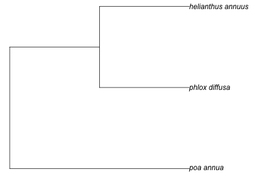
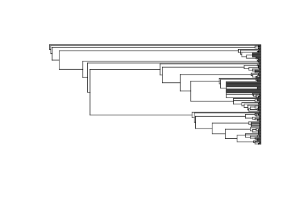

R client to fetch phylogenies from many places. Right now we only fetch phylogenies from [Phylomatic](http://phylodiversity.net/phylomatic/), but we'd like to add more sources down the road.

<section id="installation">

## Installation

Install and load `brranching` into the R session. Stable version from CRAN


```r
install.packages("brranching")
```

Or development version from Github:


```r
install.packages("devtools")
devtools::install_github("ropensci/brranching")
```


```r
library('brranching')
```

<section id="usage">

## Usage

### Phylomatic

#### Use the web service


```r
taxa <- c("Poa annua", "Phlox diffusa", "Helianthus annuus")
tree <- phylomatic(taxa = taxa, get = 'POST')
plot(tree, no.margin = TRUE)
```



You can pass in up to about 5000 names. We can use `taxize` to get a random set of plant species names.


```r
library("taxize")
spp <- names_list("species", 200)
out <- phylomatic(taxa = spp, get = "POST")
plot(out, show.tip.label = FALSE)
```



#### Use Phylomatic locally

Phylomatic is written in `Awk`, and the code can be downloaded to run locally on your own machine.
This approach is for the more adventurous user. The benefit of using Phylomatic locally is
that you can run larger set of names through - when using the web service it has a maximum number
of taxa it will take in as the maintainer does not want any one person taking up a large 
amount of server capacity.

First, download the code by doing `git clone https://github.com/camwebb/phylomatic-ws`, which 
will result in a folder `phylomatic-ws` (or download a zip file, and uncompress it). Then 
give the path to that folder in the `path` parameter in the `phylomatic_local()` function as
show below.


```r
taxa <- c("Poa annua", "Phlox diffusa", "Helianthus annuus")
(tree <- phylomatic_local(taxa, path = "~/github/play/phylomatic-ws"))
#> 
#> Phylogenetic tree with 3 tips and 2 internal nodes.
#> 
#> Tip labels:
#> [1] "poa_annua"         "phlox_diffusa"     "helianthus_annuus"
#> Node labels:
#> [1] "poales_to_asterales"   "ericales_to_asterales"
#> 
#> Rooted; no branch lengths.
```

Note how the path `~/github/play/phylomatic-ws` is specific to a computer - Change it to for 
your computer.

Then we can plot just as above using the `phylomatic()` function


```r
plot(tree, no.margin = TRUE)
```


## Citing

To cite `brranching` in publications use:

<br>

> Scott Chamberlain (2016). brranching: Fetch 'Phylogenies' from Many Sources. R package version 0.2.0. https://github.com/ropensci/brranching

<section id="license_bugs">

## License and bugs

* License: [MIT](http://opensource.org/licenses/MIT)
* Report bugs at [our Github repo for rnoaa](https://github.com/ropensci/brranching/issues?state=open)

[Back to top](#top)
