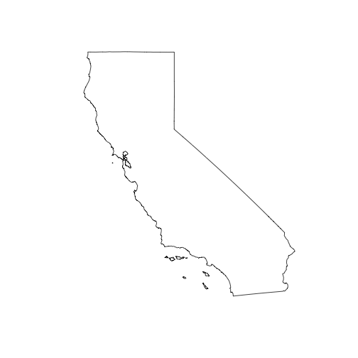

`geojsonio` converts geographic data to geojson and topojson formats. Nothing else. We hope to do this one job very well, and handle all reasonable use cases.

Functions in this package are organized first around what you're working with or want to get, geojson or topojson, then convert to or read from various formats:

* `geojson_list()` - convert to geojson as R list format
* `geojson_json()` - convert to geojson as json
* `geojson_sp()` - convert output of `geojson_list()` or `geojson_json()` to spatial objects
* `geojson_read()`/`topojson_read()` - read a geojson/topojson file from file path or URL
* `geojson_write()` - write a geojson file locally (no write topojson yet)

Each of the above functions have methods for various objects/classes, including `numeric`, `data.frame`, `list`, `SpatialPolygons`, `SpatialLines`, `SpatialPoints`, etc.

Additional functions:

* `map_gist()` - push up a geojson or topojson file as a GitHub gist (renders as an interactive map) - See the _maps with geojsonio_ vignette.
* `map_leaf()` - create a local interactive map with the `leaflet` package - See the _maps with geojsonio_ vignette. 

<section id="installation">

## Installation

Install rgdal - in case you can't get it installed from binary , here's what works on a Mac (change to the version of `rgdal` and `GDAL` you have).


```r
install.packages("http://cran.r-project.org/src/contrib/rgdal_0.9-1.tar.gz", repos = NULL, type="source", configure.args = "--with-gdal-config=/Library/Frameworks/GDAL.framework/Versions/1.11/unix/bin/gdal-config --with-proj-include=/Library/Frameworks/PROJ.framework/unix/include --with-proj-lib=/Library/Frameworks/PROJ.framework/unix/lib")
```

__Install geojsonio__

Stable version from CRAN


```r
install.packages("geojsonio")
```

Development version from GitHub


```r
if (!require("devtools")) install.packages("devtools")
devtools::install_github("ropensci/geojsonio")
```


```r
library("geojsonio")
```

<section id="usage">

## GeoJSON

### Convert various formats to geojson

From a `numeric` vector of length 2

as _json_


```r
geojson_json(c(32.45, -99.74))
#> {"type":"FeatureCollection","features":[{"type":"Feature","geometry":{"type":"Point","coordinates":[32.45,-99.74]},"properties":{}}]}
```

as a __list__


```r
geojson_list(c(32.45, -99.74))
#> $type
#> [1] "FeatureCollection"
#> 
#> $features
#> $features[[1]]
#> $features[[1]]$type
#> [1] "Feature"
#> 
#> $features[[1]]$geometry
#> $features[[1]]$geometry$type
...
```

From a `data.frame`

as __json__


```r
library('maps')
data(us.cities)
geojson_json(us.cities[1:2, ], lat = 'lat', lon = 'long')
#> {"type":"FeatureCollection","features":[{"type":"Feature","geometry":{"type":"Point","coordinates":[-99.74,32.45]},"properties":{"name":"Abilene TX","country.etc":"TX","pop":"113888","capital":"0"}},{"type":"Feature","geometry":{"type":"Point","coordinates":[-81.52,41.08]},"properties":{"name":"Akron OH","country.etc":"OH","pop":"206634","capital":"0"}}]}
```

as a __list__


```r
geojson_list(us.cities[1:2, ], lat = 'lat', lon = 'long')
#> $type
#> [1] "FeatureCollection"
#> 
#> $features
#> $features[[1]]
#> $features[[1]]$type
#> [1] "Feature"
#> 
#> $features[[1]]$geometry
#> $features[[1]]$geometry$type
...
```

From `SpatialPolygons` class


```r
library('sp')
poly1 <- Polygons(list(Polygon(cbind(c(-100,-90,-85,-100),
  c(40,50,45,40)))), "1")
poly2 <- Polygons(list(Polygon(cbind(c(-90,-80,-75,-90),
  c(30,40,35,30)))), "2")
sp_poly <- SpatialPolygons(list(poly1, poly2), 1:2)
```

to __json__


```r
geojson_json(sp_poly)
#> {"type":"FeatureCollection","features":[{"type":"Feature","id":1,"properties":{"dummy":0},"geometry":{"type":"Polygon","coordinates":[[[-100,40],[-90,50],[-85,45],[-100,40]]]}},{"type":"Feature","id":2,"properties":{"dummy":0},"geometry":{"type":"Polygon","coordinates":[[[-90,30],[-80,40],[-75,35],[-90,30]]]}}]}
```

to a __list__


```r
geojson_list(sp_poly)
#> $type
#> [1] "FeatureCollection"
#> 
#> $features
#> $features[[1]]
#> $features[[1]]$type
#> [1] "Feature"
#> 
#> $features[[1]]$id
#> [1] 1
...
```

From `SpatialPoints` class


```r
x <- c(1, 2, 3, 4, 5)
y <- c(3, 2, 5, 1, 4)
s <- SpatialPoints(cbind(x, y))
```

to __json__


```r
geojson_json(s)
#> {"type":"FeatureCollection","features":[{"type":"Feature","id":1,"properties":{"dat":1},"geometry":{"type":"Point","coordinates":[1,3]}},{"type":"Feature","id":2,"properties":{"dat":2},"geometry":{"type":"Point","coordinates":[2,2]}},{"type":"Feature","id":3,"properties":{"dat":3},"geometry":{"type":"Point","coordinates":[3,5]}},{"type":"Feature","id":4,"properties":{"dat":4},"geometry":{"type":"Point","coordinates":[4,1]}},{"type":"Feature","id":5,"properties":{"dat":5},"geometry":{"type":"Point","coordinates":[5,4]}}]}
```

to a __list__


```r
geojson_list(s)
#> $type
#> [1] "FeatureCollection"
#> 
#> $features
#> $features[[1]]
#> $features[[1]]$type
#> [1] "Feature"
#> 
#> $features[[1]]$id
#> [1] 1
...
```

### Write geojson


```r
library('maps')
data(us.cities)
geojson_write(us.cities[1:2, ], lat = 'lat', lon = 'long')
#> <geojson>
#>   Path:       myfile.geojson
#>   From class: data.frame
```

### Read geojson


```r
library("sp")
file <- system.file("examples", "california.geojson", package = "geojsonio")
out <- geojson_read(file, what = "sp")
plot(out)
```



## Topojson

In the current version of this package you can read topojson. Writing topojson was in this package, but is gone for now - will come back later as in interface to [topojson](https://github.com/mbostock/topojson) via [V8](https://github.com/jeroenooms/V8). 

Read from a file


```r
file <- system.file("examples", "us_states.topojson", package = "geojsonio")
out <- topojson_read(file, verbose = FALSE)
summary(out)
#> Object of class SpatialPolygonsDataFrame
#> Coordinates:
#>          min       max
#> x -171.79111 -66.96466
#> y   18.91619  71.35776
#> Is projected: NA 
#> proj4string : [NA]
#> Data attributes:
#>           id       name   
#>  Alabama   : 1   NA's:51  
#>  Alaska    : 1            
#>  Arizona   : 1            
#>  Arkansas  : 1            
#>  California: 1            
#>  Colorado  : 1            
#>  (Other)   :45
```

Read from a URL


```r
url <- "https://raw.githubusercontent.com/shawnbot/d3-cartogram/master/data/us-states.topojson"
out <- topojson_read(url, verbose = FALSE)
```

Or use `as.location()` first


```r
(loc <- as.location(file))
#> <location> 
#>    Type:  file 
#>    Location:  /Library/Frameworks/R.framework/Versions/3.2/Resources/library/geojsonio/examples/us_states.topojson
out <- topojson_read(loc, verbose = FALSE)
```


<section id="citing">

## Citing

> Scott Chamberlain and Andy Teucher (2016). geojsonio: Convert Data from and to 'geoJSON' or 'topoJSON'. R package version 0.1.8. https://cran.rstudio.com/package=geojsonio


<section id="license_bugs">

## License and bugs

* License: [MIT](http://opensource.org/licenses/MIT)
* Report bugs at [our GitHub repo for geojsonio](https://github.com/ropensci/geojsonio/issues?state=open)


[Back to top](#top)
