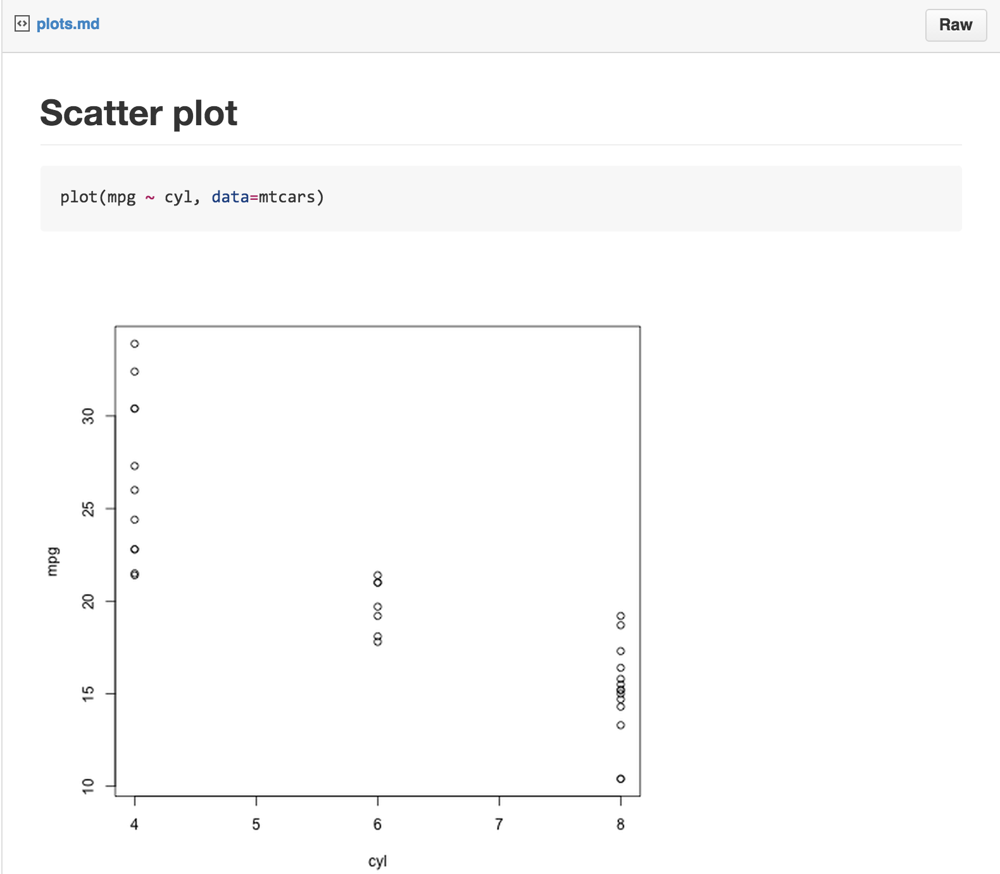
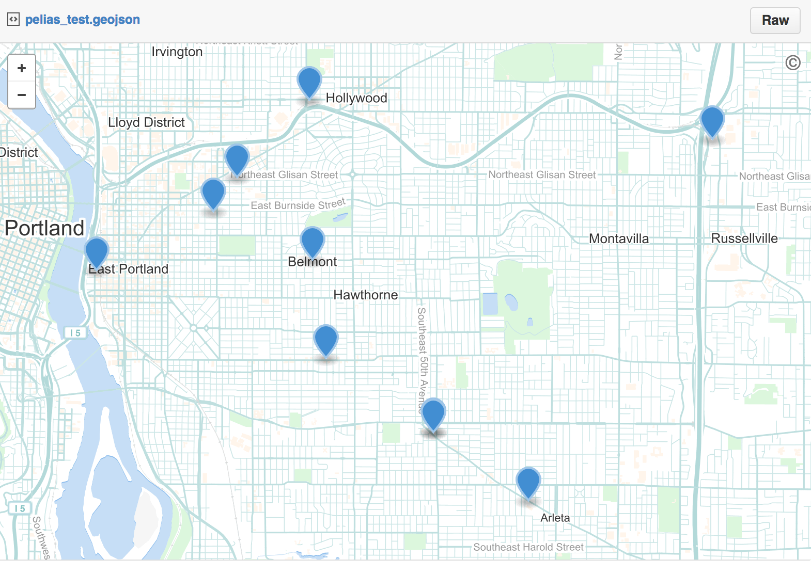

<section id="installation">

You can install from CRAN


```r
install.packages("gistr")
```

Or the development version from GitHub


```r
install.packages("devtools")
devtools::install_github("ropensci/gistr")
```

<section id="usage">


```r
library("gistr")
```

## Authentication

There are two ways to authorise gistr to work with your GitHub account:

* Generate a personal access token (PAT) at [https://help.github.com/articles/creating-an-access-token-for-command-line-use](https://help.github.com/articles/creating-an-access-token-for-command-line-use) and record it in the `GITHUB_PAT` envar.
* Interactively login into your GitHub account and authorise with OAuth.

Using the PAT is recommended.

Using the `gist_auth()` function you can authenticate seperately first, or if you're not authenticated, this function will run internally with each functionn call. If you have a PAT, that will be used, if not, OAuth will be used.


```r
gist_auth()
```

## Workflow

In `gistr` you can use pipes, introduced perhaps first in R in the package `magrittr`, to pass outputs from one function to another. If you have used `dplyr` with pipes you can see the difference, and perhaps the utility, of this workflow over the traditional workflow in R. You can use a non-piping or a piping workflow with `gistr`. Examples below use a mix of both workflows. Here is an example of a piping wofklow (with some explanation):


```r
file <- system.file("examples", "stuff.Rmd", package = "gistr")
gists(what = "minepublic")[[1]] %>% # List my public gists, and index 1st
  add_files(file) %>% # Add new file to that gist
  update() # update sends a PATCH command to Gists API to add file to your gist
```

And a non-piping workflow that does the same exact thing:


```r
file <- system.file("examples", "example1.md", package = "gistr")
g <- gists(what = "minepublic")[[1]]
g <- add_files(g, file)
update(g)
```

Or you could string them all together in one line (but it's rather difficult to follow what's going on because you have to read from the inside out)


```r
update(add_files(gists(what = "minepublic")[[1]], file))
```

## Rate limit information


```r
rate_limit()
```

```
#> Rate limit: 5000
#> Remaining:  4996
#> Resets in:  43 minutes
```


## List gists

Limiting to a few results here to keep it brief


```r
gists(per_page = 2)
```

```
#> [[1]]
#> <gist>6ff1cf71e63c640808c2
#>   URL: https://gist.github.com/6ff1cf71e63c640808c2
#>   Description: Bootstrap Customizer Config
#>   Public: TRUE
#>   Created/Edited: 2015-07-09T15:19:48Z / 2015-07-09T15:19:48Z
#>   Files: config.json
#>   Truncated?: FALSE
#> 
#> [[2]]
#> <gist>b50eaf3c875e81a082d1
#>   URL: https://gist.github.com/b50eaf3c875e81a082d1
#>   Description: Bootstrap Customizer Config
#>   Public: TRUE
#>   Created/Edited: 2015-07-09T15:19:42Z / 2015-07-09T15:19:42Z
#>   Files: config.json
#>   Truncated?: FALSE
```

Since a certain date/time


```r
gists(since = '2014-05-26T00:00:00Z', per_page = 2)
```

```
#> [[1]]
#> <gist>6ff1cf71e63c640808c2
#>   URL: https://gist.github.com/6ff1cf71e63c640808c2
#>   Description: Bootstrap Customizer Config
#>   Public: TRUE
#>   Created/Edited: 2015-07-09T15:19:48Z / 2015-07-09T15:19:48Z
#>   Files: config.json
#>   Truncated?: FALSE
#> 
#> [[2]]
#> <gist>b50eaf3c875e81a082d1
#>   URL: https://gist.github.com/b50eaf3c875e81a082d1
#>   Description: Bootstrap Customizer Config
#>   Public: TRUE
#>   Created/Edited: 2015-07-09T15:19:42Z / 2015-07-09T15:19:42Z
#>   Files: config.json
#>   Truncated?: FALSE
```

Request different types of gists, one of public, minepublic, mineall, or starred.


```r
gists('minepublic', per_page = 2)
```

```
#> [[1]]
#> <gist>2427d0cd92bc2ca8dc73
#>   URL: https://gist.github.com/2427d0cd92bc2ca8dc73
#>   Description: gist gist gist
#>   Public: TRUE
#>   Created/Edited: 2015-07-09T11:04:42Z / 2015-07-09T11:04:42Z
#>   Files: stuff.md
#>   Truncated?: FALSE
#> 
#> [[2]]
#> <gist>a2fc9d52e9e4ce4e20dd
#>   URL: https://gist.github.com/a2fc9d52e9e4ce4e20dd
#>   Description: gist gist gist
#>   Public: TRUE
#>   Created/Edited: 2015-07-09T11:03:16Z / 2015-07-09T11:03:17Z
#>   Files: stuff.md, zoo.json
#>   Truncated?: FALSE, FALSE
```


## List a single gist


```r
gist(id = 'f1403260eb92f5dfa7e1')
```

```
#> <gist>f1403260eb92f5dfa7e1
#>   URL: https://gist.github.com/f1403260eb92f5dfa7e1
#>   Description: Querying bitly from R 
#>   Public: TRUE
#>   Created/Edited: 2014-10-15T20:40:12Z / 2014-10-15T21:54:29Z
#>   Files: bitly_r.md
#>   Truncated?: FALSE
```

## Easily play with gist data

A new function in `v0.2` is `tabl()` (weirdly named to avoid collision with `base::table()`),
which attempts to parse data on gists into data.frame's for easy manipulation.

Here, we play with commit data on each of 30 gists


```r
library("dplyr")
x <- sapply(c(gists(), gists()), commits)
tabl(x) %>%
  select(id, login, change_status.total, url) %>%
  filter(change_status.total > 70)
```

```
#> Source: local data frame [36 x 4]
#> 
#>         id                 login change_status.total
#> 1  5064599          brainsapiens                 345
#> 2   148100 invalid-email-address                 412
#> 3   148100 invalid-email-address                 401
#> 4   148100 invalid-email-address                 433
#> 5   148100 invalid-email-address                 401
#> 6  1038301            jim-minter                 125
#> 7   148100 invalid-email-address                 433
#> 8   148100 invalid-email-address                 433
#> 9       NA                    NA                  90
#> 10      NA                    NA                 158
#> ..     ...                   ...                 ...
#> Variables not shown: url (chr)
```

## Create gist

You can pass in files

First, get a file to work with


```r
stuffpath <- system.file("examples", "stuff.md", package = "gistr")
```


```r
gist_create(files = stuffpath, description='a new cool gist')
```


```r
gist_create(files = stuffpath, description = 'a new cool gist', browse = FALSE)
```

```
#> <gist>5d2733f57be3543dafe3
#>   URL: https://gist.github.com/5d2733f57be3543dafe3
#>   Description: a new cool gist
#>   Public: TRUE
#>   Created/Edited: 2015-07-09T15:20:14Z / 2015-07-09T15:20:14Z
#>   Files: stuff.md
#>   Truncated?: FALSE
```

Or, wrap `gist_create()` around some code in your R session/IDE, like so, with just the function name, and a `{'` at the start and a `}'` at the end.


```r
gist_create(code = {'
x <- letters
numbers <- runif(8)
numbers

[1] 0.3229318 0.5933054 0.7778408 0.3898947 0.1309717 0.7501378 0.3206379 0.3379005
'}, browse = FALSE)
```

```
#> <gist>4c074778e8f43fe34ed4
#>   URL: https://gist.github.com/4c074778e8f43fe34ed4
#>   Description: 
#>   Public: TRUE
#>   Created/Edited: 2015-07-09T15:20:14Z / 2015-07-09T15:20:14Z
#>   Files: code.R
#>   Truncated?: FALSE
```

You can also knit an input file before posting as a gist:


```r
file <- system.file("examples", "stuff.Rmd", package = "gistr")
gist_create(file, description = 'a new cool gist', knit=TRUE)
#> <gist>4162b9c53479fbc298db
#>   URL: https://gist.github.com/4162b9c53479fbc298db
#>   Description: a new cool gist
#>   Public: TRUE
#>   Created/Edited: 2014-10-27T16:07:31Z / 2014-10-27T16:07:31Z
#>   Files: stuff.md
```

Or code blocks before (note that code blocks without knitr block demarcations will result in unexecuted code):


```r
gist_create(code = {'
x <- letters
(numbers <- runif(8))
'}, knit = TRUE)
#> <gist>ec45c396dee4aa492139
#>   URL: https://gist.github.com/ec45c396dee4aa492139
#>   Description:
#>   Public: TRUE
#>   Created/Edited: 2014-10-27T16:09:09Z / 2014-10-27T16:09:09Z
#>   Files: file81720d1ceff.md
```

## knit code from file path, code block, or gist file

knit a local file


```r
file <- system.file("examples", "stuff.Rmd", package = "gistr")
run(file, knitopts = list(quiet = TRUE)) %>%
  gist_create(browse = FALSE)
```

```
#> <gist>5d1b024b9e6d9f1019c2
#>   URL: https://gist.github.com/5d1b024b9e6d9f1019c2
#>   Description: 
#>   Public: TRUE
#>   Created/Edited: 2015-07-09T15:20:14Z / 2015-07-09T15:20:14Z
#>   Files: stuff.md
#>   Truncated?: FALSE
```


knit a code block (`knitr` code block notation missing, do add that in) (result not shown)


```r
run({'
x <- letters
(numbers <- runif(8))
'}) %>% gist_create
```

knit a file from a gist, has to get file first (result not shown)


```r
gists('minepublic')[[1]] %>%
  run() %>%
  update()
```

## Include source file in the created gist


```r
file <- system.file("examples", "stuff.Rmd", package = "gistr")
gist_create(file, knit = TRUE, include_source = TRUE)
```

## Inject image links with IMGUR


```r
file <- system.file("examples", "plots.Rmd", package = "gistr")
gist_create(file, knit = TRUE, imgur_inject = TRUE)
```



## Create gists from R objects

First, `gist_create_obj()` was made a separate function from `gist_create()` because there was
a bunch of different parameters, and it was too complicated to cobmine. Behavior of this function
is a bit dumb at this point, e.g., if a data.frame is pushed up to a gist, you'd expect a
markdown table probably - but that doesn't quite work yet, sorry :) For other formats (e.g.,
lists), it's not clear what to show in a gist.

__data.frame__

by default makes pretty table in markdown format


```r
row.names(mtcars) <- NULL
gist_create_obj(mtcars)
```

```
#> <gist>eb8e2a7318441e978b31
#>   URL: https://gist.github.com/eb8e2a7318441e978b31
#>   Description: 
#>   Public: TRUE
#>   Created/Edited: 2015-07-09T15:20:16Z / 2015-07-09T15:20:16Z
#>   Files: file.txt
#>   Truncated?: FALSE
```

or just push up json


```r
gist_create_obj(mtcars, pretty = FALSE)
```

```
#> <gist>fdbb77870162a53e1084
#>   URL: https://gist.github.com/fdbb77870162a53e1084
#>   Description: 
#>   Public: TRUE
#>   Created/Edited: 2015-07-09T15:20:16Z / 2015-07-09T15:20:16Z
#>   Files: file.txt
#>   Truncated?: FALSE
```

__list__


```r
gist_create_obj(apply(mtcars, 1, as.list))
```

```
#> <gist>ab391646dea1e914d757
#>   URL: https://gist.github.com/ab391646dea1e914d757
#>   Description: 
#>   Public: TRUE
#>   Created/Edited: 2015-07-09T15:20:17Z / 2015-07-09T15:20:17Z
#>   Files: file.txt
#>   Truncated?: FALSE
```

## List commits on a gist


```r
gists()[[1]] %>% commits()
```

```
#> [[1]]
#> <commit>
#>   Version: 43352a6bc4076b09347a38830d3dd26b2e6f145c
#>   User: sckott
#>   Commited: 2015-07-09T15:20:17Z
#>   Commits [total, additions, deletions]: [1,1,0]
```

## Star a gist

Star


```r
gist('7ddb9810fc99c84c65ec') %>% star()
```

```
#> <gist>7ddb9810fc99c84c65ec
#>   URL: https://gist.github.com/7ddb9810fc99c84c65ec
#>   Description: 
#>   Public: TRUE
#>   Created/Edited: 2014-06-27T17:50:37Z / 2015-07-03T01:19:29Z
#>   Files: code.R, manifest.yml, rrt_manifest.yml
#>   Truncated?: FALSE, FALSE, FALSE
```

Unstar


```r
gist('7ddb9810fc99c84c65ec') %>% unstar()
```

```
#> <gist>7ddb9810fc99c84c65ec
#>   URL: https://gist.github.com/7ddb9810fc99c84c65ec
#>   Description: 
#>   Public: TRUE
#>   Created/Edited: 2014-06-27T17:50:37Z / 2015-07-03T01:19:29Z
#>   Files: code.R, manifest.yml, rrt_manifest.yml
#>   Truncated?: FALSE, FALSE, FALSE
```

## Update a gist

Add files

First, path to file


```r
file <- system.file("examples", "alm.md", package = "gistr")
```


```r
gists(what = "minepublic")[[1]] %>%
  add_files(file) %>%
  update()
```

```
#> <gist>ab391646dea1e914d757
#>   URL: https://gist.github.com/ab391646dea1e914d757
#>   Description: 
#>   Public: TRUE
#>   Created/Edited: 2015-07-09T15:20:17Z / 2015-07-09T15:20:19Z
#>   Files: alm.md, file.txt
#>   Truncated?: FALSE, FALSE
```

Delete files


```r
gists(what = "minepublic")[[1]] %>%
  delete_files(file) %>%
  update()
```

```
#> <gist>ab391646dea1e914d757
#>   URL: https://gist.github.com/ab391646dea1e914d757
#>   Description: 
#>   Public: TRUE
#>   Created/Edited: 2015-07-09T15:20:17Z / 2015-07-09T15:20:20Z
#>   Files: file.txt
#>   Truncated?: FALSE
```

## Open a gist in your default browser


```r
gists()[[1]] %>% browse()
```

> Opens the gist in your default browser

## Get embed script


```r
gists()[[1]] %>% embed()
```

```
#> [1] "<script src=\"https://gist.github.com/sckott/ab391646dea1e914d757.js\"></script>"
```

### List forks

Returns a list of `gist` objects, just like `gists()`


```r
gist(id = '1642874') %>% forks(per_page = 2)
```

```
#> [[1]]
#> <gist>1642989
#>   URL: https://gist.github.com/1642989
#>   Description: Spline Transition
#>   Public: TRUE
#>   Created/Edited: 2012-01-19T21:45:20Z / 2015-06-11T19:40:48Z
#>   Files: 
#>   Truncated?: 
#> 
#> [[2]]
#> <gist>1643051
#>   URL: https://gist.github.com/1643051
#>   Description: Line Transition (Broken)
#>   Public: TRUE
#>   Created/Edited: 2012-01-19T21:51:30Z / 2015-06-11T19:40:48Z
#>   Files: 
#>   Truncated?:
```

## Fork a gist

Returns a `gist` object


```r
g <- gists()
(forked <- g[[ sample(seq_along(g), 1) ]] %>% fork())
```

```
#> <gist>9253803d418cd3417f97
#>   URL: https://gist.github.com/9253803d418cd3417f97
#>   Description: Format any number to #.##
#>   Public: TRUE
#>   Created/Edited: 2015-07-09T15:20:21Z / 2015-07-09T15:20:21Z
#>   Files: NumberFormat.php
#>   Truncated?: FALSE
```


## Example use case

_Working with the Mapzen Pelias geocoding API_

The API is described at [https://github.com/pelias/pelias](https://github.com/pelias/pelias), and is still in alpha they say. The steps: get data, make a gist. The data is returned from Mapzen as geojson, so all we have to do is literally push it up to GitHub gists and we're done b/c GitHub renders the map.


```r
library('httr')
base <- "http://pelias.mapzen.com/search"
res <- GET(base, query = list(input = 'coffee shop', lat = 45.5, lon = -122.6))
json <- content(res, as = "text")
gist_create(code = json, filename = "pelias_test.geojson")
#> <gist>017214637bcfeb198070
#>   URL: https://gist.github.com/017214637bcfeb198070
#>   Description:
#>   Public: TRUE
#>   Created/Edited: 2014-10-28T14:42:36Z / 2014-10-28T14:42:36Z
#>   Files: pelias_test.geojson
```

And here's that gist: [https://gist.github.com/sckott/017214637bcfeb198070](https://gist.github.com/sckott/017214637bcfeb198070)




<section id="citing">

## Citing

> Ramnath Vaidyanathan, Karthik Ram and Scott Chamberlain (2015). gistr: Work with
  GitHub Gists from R. R package version 0.3.0. https://github.com/ropensci/gistr


<section id="license_bugs">

## License and bugs

* License: [MIT](http://opensource.org/licenses/MIT)
* Report bugs at [our GitHub repo for gistr](https://github.com/ropensci/gistr/issues?state=open)


[Back to top](#top)
