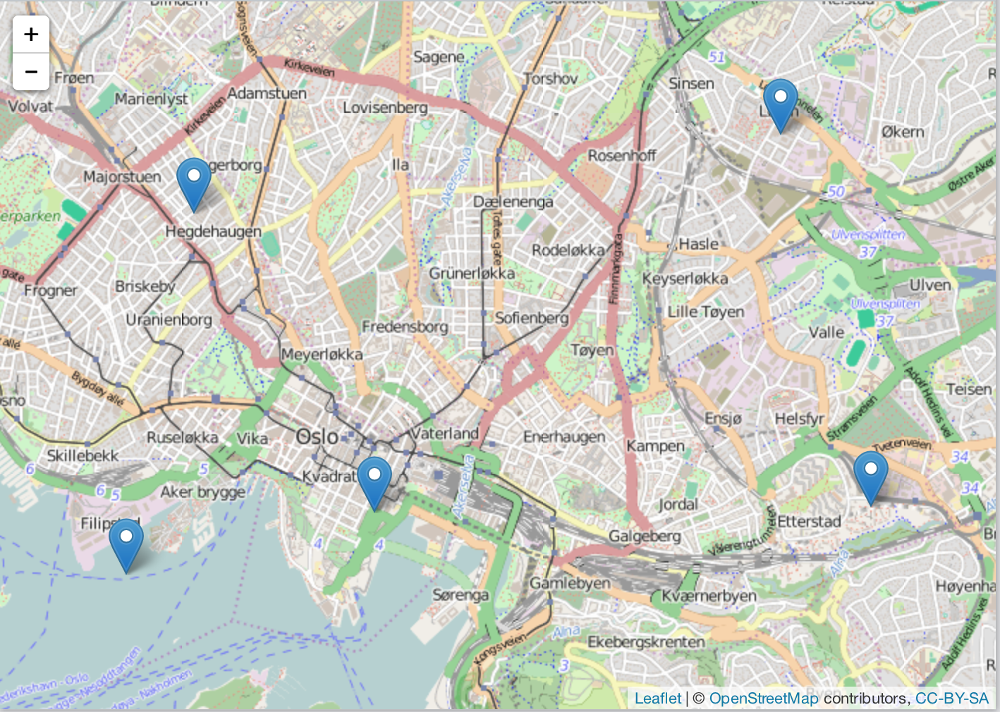

`lawn` is an R wrapper for the Javascript library [turf.js](http://turfjs.org/) for advanced geospatial analysis. In addition, we have a few functions to interface with the [geojson-random](https://github.com/mapbox/geojson-random) Javascript library.

`lawn` includes traditional spatial operations, helper functions for creating GeoJSON data, and data classification and statistics tools.

There is an additional helper function (see `view()`) in this package to help visualize data with interactive maps via the `leaflet` package ([https://github.com/rstudio/leaflet](https://github.com/rstudio/leaflet)). Note that `leaflet` is not required to install `lawn` - it's in Suggests, not Imports or Depends.

<section id="installation">

## Installation

If installing `leaflet`


```r
devtools::install_github("rstudio/leaflet")
```

Stable `lawn` version from CRAN


```r
install.packages("lawn")
```

Or, the development version from Github


```r
devtools::install_github("ropensci/lawn")
```


```r
library("lawn")
```

<section id="usage">

## Usage

### Make some geojson data

Point


```r
lawn_point(c(-74.5, 40))
#> <Point>
#>   Bounding box: -74.5 40.0 -74.5 40.0
#>   Coordinates: -74.5 40.0
#>   Properties: NULL
```

Polygon


```r
rings <- list(list(
  c(-2.275543, 53.464547),
  c(-2.275543, 53.489271),
  c(-2.215118, 53.489271),
  c(-2.215118, 53.464547),
  c(-2.275543, 53.464547)
))
lawn_polygon(rings)
#> <Polygon>
#>   Bounding box: -2.3 53.5 -2.2 53.5
#>   No. points: 5
#>   Properties: NULL
```

### count

Count number of points within polygons


```r
lawn_count(polygons = lawn_data$polygons_count, points = lawn_data$points_count)
#> <FeatureCollection>
#>   Bounding box: -112.1 46.6 -112.0 46.6
#>   No. features: 2
#>   No. points: 20
#>   Properties: NULL
```

### average

Average value of a field for a set of points within a set of polygons


```r
lawn_average(polygons = lawn_data$polygons_average,
             points = lawn_data$points_average,
             field = 'population')
#> <FeatureCollection>
#>   Bounding box: 10.7 59.9 10.9 59.9
#>   No. features: 2
#>   No. points: 20
#>   Properties: NULL
```

### distance

Define two points


```r
from <- '{
 "type": "Feature",
 "properties": {},
 "geometry": {
   "type": "Point",
   "coordinates": [-75.343, 39.984]
 }
}'
to <- '{
  "type": "Feature",
  "properties": {},
  "geometry": {
    "type": "Point",
    "coordinates": [-75.534, 39.123]
  }
}'
```

Calculate distance, default units is kilometers (default output: `km`)


```r
lawn_distance(from, to)
#> [1] 97.15958
```

### random set of points


```r
lawn_random(n = 2)
#> <FeatureCollection>
#>   Bounding box: -95.9 -27.5 127.6 49.4
#>   No. features: 2
#>   No. points: 4
#>   Properties: NULL
```


```r
lawn_random(n = 5)
#> <FeatureCollection>
#>   Bounding box: -155.2 -88.4 88.1 7.9
#>   No. features: 5
#>   No. points: 10
#>   Properties: NULL
```

### random features with geojson-random

Positions


```r
gr_position()
#> [1] -23.04592 -51.32943
```

Points


```r
gr_point(2)
#> <FeatureCollection>
#>   Bounding box: -1.4 24.6 174.8 65.0
#>   No. features: 2
#>   No. points: 4
#>   Properties: NULL
```

Polygons


```r
gr_polygon(n = 1, vertices = 5, max_radial_length = 5)
#> <FeatureCollection>
#>   Bounding box: -74.6 -16.2 -68.8 -8.2
#>   No. features: 1
#>   No. points: 12
#>   Properties: NULL
```

### sample from a FeatureCollection


```r
dat <- lawn_data$points_average
lawn_sample(dat, 1)
#> <FeatureCollection>
#>   Bounding box: 10.8 59.9 10.8 59.9
#>   No. features: 1
#>   No. points: 2
#>   Properties: NULL
```


```r
lawn_sample(dat, 2)
#> <FeatureCollection>
#>   Bounding box: 10.7 59.9 10.8 59.9
#>   No. features: 2
#>   No. points: 4
#>   Properties: NULL
```


```r
lawn_sample(dat, 3)
#> <FeatureCollection>
#>   Bounding box: 10.7 59.9 10.8 59.9
#>   No. features: 3
#>   No. points: 6
#>   Properties: NULL
```

### extent


```r
lawn_extent(lawn_data$points_average)
#> [1] 10.71579 59.90478 10.80643 59.93162
```

### within


```r
lawn_within(lawn_data$points_within, lawn_data$polygons_within)
#> <FeatureCollection>
#>   Bounding box: -46.6 -23.6 -46.6 -23.6
#>   No. features: 2
#>   No. points: 4
#>   Properties: NULL
```

### buffer


```r
dat <- '{
 "type": "Feature",
 "properties": {},
 "geometry": {
     "type": "Polygon",
     "coordinates": [[
       [-112.072391,46.586591],
       [-112.072391,46.61761],
       [-112.028102,46.61761],
       [-112.028102,46.586591],
       [-112.072391,46.586591]
     ]]
   }
}'
lawn_buffer(dat, 1, "miles")
#> <FeatureCollection>
#>   Bounding box: -112.1 46.6 -112.0 46.6
#>   No. features: 1
#>   No. points: 74
#>   Properties: NULL
```

### lint input geojson

For most functions, you can lint your input geojson data to make sure it is proper geojson. We use
the javascript library geojsonhint. See the `lint` parameter where available.

Good GeoJSON


```r
dat <- '{
  "type": "FeatureCollection",
  "features": [
    {
      "type": "Feature",
      "properties": {
        "population": 200
      },
      "geometry": {
        "type": "Point",
        "coordinates": [10.724029, 59.926807]
      }
    },
      {
      "type": "Feature",
      "properties": {
        "population": 600
      },
      "geometry": {
        "type": "Point",
        "coordinates": [10.715789, 59.904778]
      }
    }
  ]
}'
lawn_extent(dat)
#> [1] 10.71579 59.90478 10.72403 59.92681
```

Bad GeoJSON


```r
dat <- '{
  "type": "FeatureCollection",
  "features": [
    {
      "type": "Feature",
      "properties": {
        "population": 200
      },
      "geometry": {
        "type": "Point"
      }
    },
      {
      "type": "Feature",
      "properties": {
        "population": 600
      },
      "geometry": {
        "type": "Point",
        "coordinates": [10.715789, 59.904778]
      }
    }
  ]
}'
lawn_extent(dat, lint = TRUE)

#> Error: Line 1 - "coordinates" property required
```

### view

`lawn` includes a tiny helper function for visualizing geojson.


```r
view(lawn_data$points_average)
```



Here, we sample at random two points from the same dataset just viewed.


```r
lawn_sample(lawn_data$points_average, 2) %>% view()
```


<section id="citing">

## Citing

To cite `lawn` in publications use:

<br>

> Scott Chamberlain and Jeff Hollister (2015). lawn: R Client for Turf.js for Geospatial
  Analysis. R package version 0.1.4. https://github.com/ropensci/lawn

<section id="license_bugs">

## License and bugs

* License: [MIT](http://opensource.org/licenses/MIT)
* Report bugs at [our Github repo for lawn](https://github.com/ropensci/lawn/issues?state=open)

[Back to top](#top)
