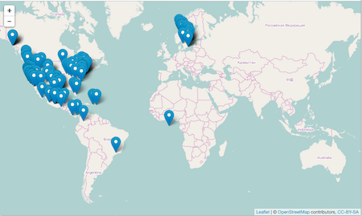
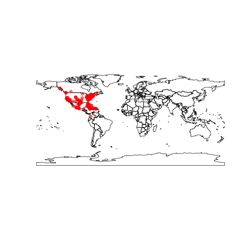
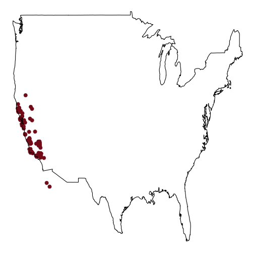

Utilities for 'vizualizing' species occurrence data. Includes functions to 'vizualize' occurrence data from 'spocc', 'rgbif', and other packages. Mapping options included for base R plots, 'ggplot2', and various interactive maps.

<section id="installation">

## Installation

Stable version from CRAN


```r
install.packages("mapr")
```

Development version from GitHub


```r
if (!require("devtools")) install.packages("devtools")
devtools::install_github("ropensci/mapr")
```


```r
library("mapr")
library("spocc")
```

<section id="usage">

### Interactive maps

#### Leaflet.js

[Leaflet JS](http://leafletjs.com/) is an open source mapping library that can leverage various layers from multiple sources. Using the [`leaflet`](http://cran.rstudio.com/package=leaflet) library, we can generate a local interactive map of species occurrence data.

An example:


```r
spp <- c('Danaus plexippus','Accipiter striatus','Pinus contorta')
dat <- occ(query = spp, from = 'gbif', has_coords = TRUE, limit = 100)
map_leaflet(dat)
```



#### Geojson map as a Github gist

You can also create interactive maps via the `mapgist` function. You have to have a Github account to use this function. Github accounts are free though, and great for versioning and collaborating on code or papers. When you run the `map_gist` function it will ask for your Github username and password. You can alternatively store those in your `.Rprofile` file by adding entries for username (`options(github.username = 'username')`) and password (`options(github.password = 'password')`).


```r
spp <- c('Danaus plexippus', 'Accipiter striatus', 'Pinus contorta')
dat <- occ(query = spp, from = 'gbif', has_coords = TRUE, limit = 100)
dat <- fixnames(dat)
map_gist(dat, color = c("#976AAE", "#6B944D", "#BD5945"))
```


### Static maps

#### base plots

Base plots, or the built in plotting facility in R accessed via `plot()`, is quite fast, but not easy or efficient to use, but are good for a quick glance at some data.


```r
spnames <- c('Accipiter striatus', 'Setophaga caerulescens', 'Spinus tristis')
out <- occ(query = spnames, from = 'gbif', has_coords = TRUE, limit = 100)
map_plot(out, cex = 1, pch = 10)
```



#### ggplot2

`ggplot2` is a powerful package for making visualizations in R. Read more about it [here](https://cran.rstudio.com/web/packages/ggplot2/).


```r
dat <- occ(query = 'Lynx rufus californicus', from = 'gbif', has_coords = TRUE, limit = 200)
map_ggplot(dat, map = "usa")
```



### The supported inputs

All functions take the following kinds of inputs:

* An object of class `occdat`, from the package `spocc`. An object of
this class is composed of many objects of class `occdatind`
* An object of class `occdatind`, from the package `spocc`
* An object of class `gbif`, from the package `rgbif`
* An object of class `data.frame`. This data.frame can have any columns, but
must include a column for taxonomic names (e.g., `name`), and for latitude
and longitude (we guess your lat/long columns, starting with the default
`latitude` and `longitude`).
* An object of class `SpatialPoints`
* An object of class `SpatialPointsDatFrame`

<section id="citing">

## Citing

> Scott Chamberlain (2016). mapr: 'Visualize' Species Occurrence Data. R package version 0.2.0. https://cran.rstudio.com/package=mapr


<section id="license_bugs">

## License and bugs

* License: [MIT](http://opensource.org/licenses/MIT)
* Report bugs at [our GitHub repo for mapr](https://github.com/ropensci/mapr/issues?state=open)


[Back to top](#top)
