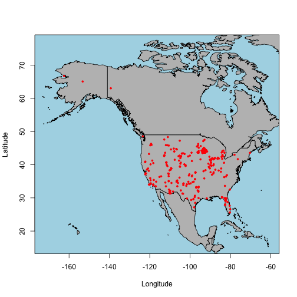
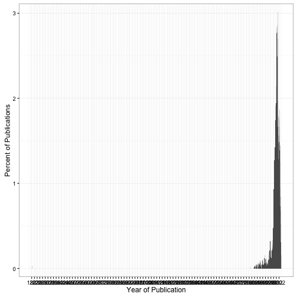

The `neotoma` package is a programmatic R interface to the [Neotoma Paleoecological Database](http://www.neotomadb.org/). The package is intended to both allow users to search for sites and to download data for use in analyical workflows of paleoecological research.

For more information on the package please refer to:

Goring, S., Dawson, A., Simpson, G. L., Ram, K., Graham, R. W., Grimm, E. C., & Williams, J. W.. (2015). neotoma: A Programmatic Interface to the Neotoma Paleoecological Database. *Open Quaternary*, 1(1), Art. 2. DOI: [10.5334/oq.ab](http://doi.org/10.5334/oq.ab)

<section id="installation">

## Installation


```r
install.packages("neotoma")
```

Or development version from GitHub


```r
install.packages("devtools")
devtools::install_github("ropensci/neotoma")
```


```r
library("neotoma")
```

<section id="usage">

## Usage

### Distribution of sites with Mammoth fossils in Neotoma

Example requires the mapdata package:


```r
library('mapdata')
```

You may use either '%' or '*' as wildcards for search terms:


```r
test <- get_dataset(taxonname='Mammuthus*')
```

The API call was successful, you have returned  3273 records.


```r
site.locs <- get_site(test)
```

A crude way of making the oceans blue.


```r
plot(1, type = 'n',
     xlim=range(site.locs$long)+c(-10, 10),
     ylim=range(site.locs$lat)+c(-10, 10),
     xlab='Longitude', ylab = 'Latitude')
rect(par("usr")[1],par("usr")[3],par("usr")[2],par("usr")[4],col = "lightblue")
map('world',
    interior=TRUE,
    fill=TRUE,
    col='gray',
    xlim=range(site.locs$long)+c(-10, 10),
    ylim=range(site.locs$lat)+c(-10, 10),
    add=TRUE)
points(site.locs$long, site.locs$lat, pch=19, cex=0.5, col='red')
```



### Proportion of publications/year for Neotoma datasets


```r
library('ggplot2')
library('plyr')
pubs <- get_publication()
#> The API call was successful, you have returned  6592 records.
pub.years <- ldply(pubs, "[[", "meta")
ggplot(pub.years, aes(x = year)) +
     stat_bin(aes(y = ..density..*100, position = 'dodge'), binwidth = 1) +
     theme_bw() +
     ylab('Percent of Publications') +
     xlab('Year of Publication') +
     scale_y_continuous(expand = c(0, 0.1)) +
     scale_x_continuous(
       breaks = seq(min(pub.years$year, na.rm = TRUE), 2014, by = 20))
```




<section id="citing">

## Citing

To cite `neotoma` in publications use:

<br>

> John Harrison (2016). neotoma: R Bindings for Selenium WebDriver. R
  package version 1.4.0. https://cran.rstudio.com/package=neotoma

<section id="license_bugs">

## License and bugs

* License: [MIT](http://opensource.org/licenses/MIT)
* Report bugs at [our Github repo for neotoma](https://github.com/ropensci/neotoma/issues?state=open)

[Back to top](#top)
