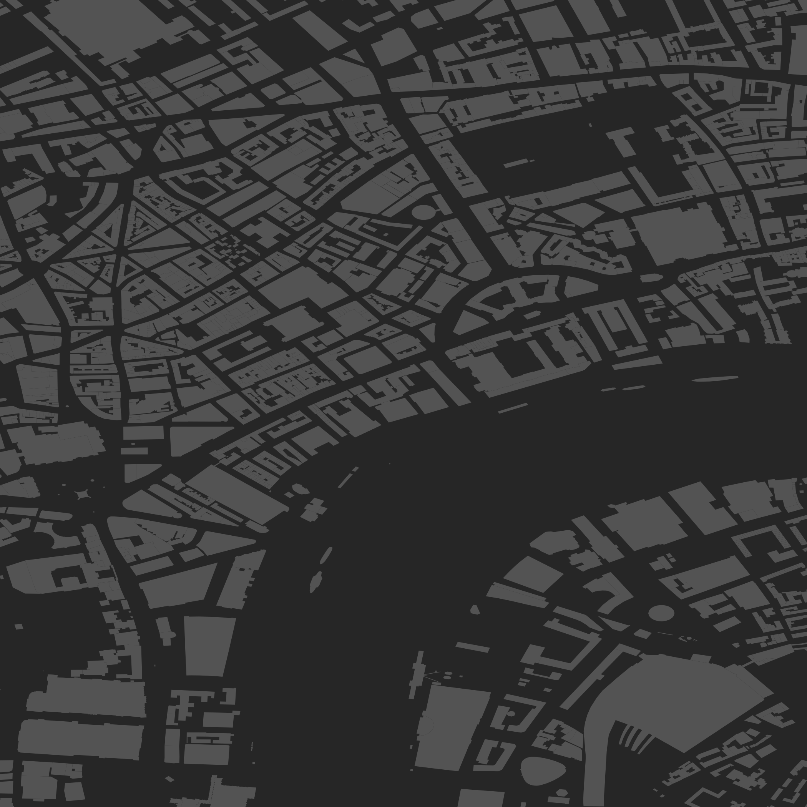
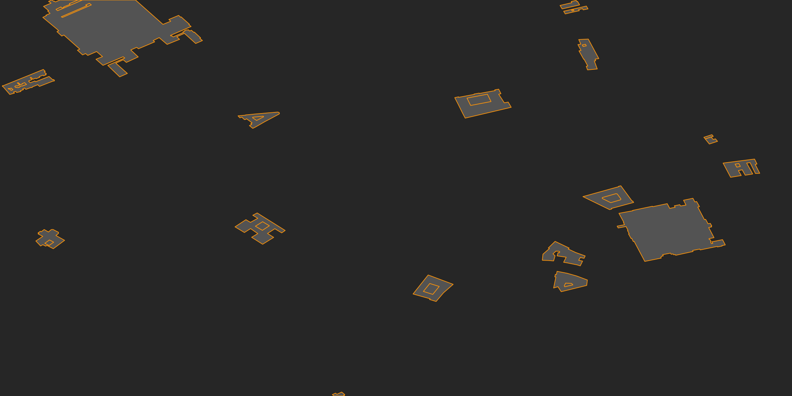

<section id="installation">

## Installation

Stable version from CRAN


```r
install.packages("osmplotr")
```


Development version from GitHub


```r
if (!require("devtools")) install.packages("devtools")
devtools::install_github("ropenscilabs/osmplotr")
```


```r
library("osmplotr")
library("maptools")
```

<section id="usage">

## Usage


### Introduction

A map can be generated using the following simple steps:


1. Specify the bounding box for the desired region


```r
bbox <- get_bbox(c(-0.13, 51.50, -0.11, 51.52))
```

2. Download the desired data---in this case, all building perimeters.


```r
dat_B <- extract_osm_objects(key='building', bbox=bbox)
```

3. Initiate an `osm_basemap` with desired background (`bg`) colour


```r
map <- osm_basemap(bbox = bbox, bg = 'gray20')
```

4. Add desired plotting objects in the desired colour.


```r
map <- add_osm_objects(map, dat_B, col = 'gray40')
```

5. Print the map


```r
print_osm_map(map)
```



The function `print_osm_map` creates a graphics device that is scaled to the
bounding box of the map.  Note also that `osmplotr` maps contain no margins and
fill the entire plot area.  Additional capabilities of `osmplotr` are described
in the following sections, beginning with downloading and extraction of data.

### Downloading Data

The main function for downloading OSM data from the
[overpass API](https://overpass-api.de) is `extract_osm_objects`. Data of a
particular type can be extracted by passing the appropriate OSM `key`, as in the
above example:


```r
bbox <- get_bbox (c(-0.13,51.51,-0.11,51.52))
dat_B <- extract_osm_objects(key='building', bbox=bbox)
dat_H <- extract_osm_objects(key='highway', bbox=bbox)
```

These objects are of appropriate `Spatial` classes:


```r
class(dat_B); class(dat_H)
```

```
#> [1] "SpatialPolygonsDataFrame"
#> attr(,"package")
#> [1] "sp"
```

```
#> [1] "SpatialLinesDataFrame"
#> attr(,"package")
#> [1] "sp"
```

The `SpatialPolygonsDataFrame` and `SpatialLinesDataFrame`
of London buildings and highways respectively
contain


```r
length(dat_B); length(dat_H)
```

```
#> [1] 2178
```

```
#> [1] 2139
```

... 2,178 building polygons and 2,139 highway lines.  `extract_osm_objects` also
accepts `key-value` pairs which are passed to the
[overpass API](https://overpass-api.de) :


```r
dat_T <- extract_osm_objects(key = 'natural', value = 'tree', bbox = bbox)
```

Trees are located by single coordinates and are thus `SpatialPoints`:


```r
class(dat_T); length(dat_T)
```

```
#> [1] "SpatialPointsDataFrame"
#> attr(,"package")
#> [1] "sp"
```

```
#> [1] 1310
```

### Negation

Negation can be specified by pre-pending `!` to the `value` argument so that,
for example, all `natural` objects that are **not** trees can be extracted with


```r
dat_NT <- extract_osm_objects (key='natural', value='!tree', bbox=bbox)
```

`london$dat_H` contains all non-primary highways, and was extracted with,


```r
dat_H <- extract_osm_objects (key='highway', value='!primary', bbox=bbox)
```

### Additional `key-value` pairs

Any number of `key-value` pairs may be passed to `extract_osm_objects`. For
example, a named building can be extracted with


```r
extra_pairs <- c ('name', 'Royal.Festival.Hall')
dat <- extract_osm_objects (key='building', extra_pairs=extra_pairs,
                                       bbox=bbox)
```

This data is stored in `london$dat_RFH`. Note that periods or dots are used for
whitespace, and in fact symbolise (in `grep` terms) any character whatsoever.
The polygon of a building at a particular street address can be extracted with


```r
extra_pairs <- list (c ('addr:street', 'Stamford.St'),
                     c ('addr:housenumber', '150'))
dat <- extract_osm_objects (key='building', extra_pairs=extra_pairs,
                                      bbox=bbox)
```

This data is stored as `london$dat_ST`.  Note that addresses generally require
combining both `addr:street` with `addr:housenumber`.

### Downloading with `osm_structures` and `make_osm_map`

The functions `osm_structures` and `make_osm_map` aid both downloading multiple
OSM data types and plotting (with the latter described below).  `osm_structures`
returns a `data.frame` of OSM structure types, associated `key-value` pairs,
unique suffices which may be appended to data structures for storage purposes,
and suggested colours. Passing this list to `make_osm_map` will return a list of
the requested OSM data items, named through combining the `dat_prefix` specified
in `make_osm_map` and the suffices specified in `osm_structures`.


```r
osm_structures()
```

```
#>     structure      key value suffix      cols
#> 1    building building           BU #646464FF
#> 2     amenity  amenity            A #787878FF
#> 3    waterway waterway            W #646478FF
#> 4       grass  landuse grass      G #64A064FF
#> 5     natural  natural            N #647864FF
#> 6        park  leisure  park      P #647864FF
#> 7     highway  highway            H #000000FF
#> 8    boundary boundary           BO #C8C8C8FF
#> 9        tree  natural  tree      T #64A064FF
#> 10 background                          gray20
```

Many structures are identified by keys only, in which cases the values are empty
strings.


```r
osm_structures()$value[1:4]
```

```
#> [1] ""      ""      ""      "grass"
```

The last row of `osm_structures` exists only to define the background colour of
the map, as explained below
([3.3. Automating map production](#3.3 make-osm-map)).

The suffices include as many letters as are necessary to represent all unique
structure names.  `make_osm_map` returns a list of two components:

1. `osm_data` containing the data objects passed in the `osm_structures`
   argument. Any existing `osm_data` may also be submitted to `make_osm_map`, in
   which case any objects not present in the submitted data will be
   appended to the returned version. If `osm_data` is not submitted, all objects in
   `osm_structures` will be downloaded and returned.
2. `map` containing the `ggplot2` map objects with layers overlaid according to
   the sequence and colour schemes specified in `osm_structures`

The data specified in `osm_structures` can then be downloaded simply by calling:


```r
dat <- make_osm_map(structures=osm_structures (), bbox=bbox)
```


```r
names(dat)
```

```
#> [1] "osm_data" "map"
```

```r
sapply(dat, class)
```

```
#> $osm_data
#> [1] "list"
#> 
#> $map
#> [1] "gg"     "ggplot"
```

```r
names(dat$osm_data)
```

```
#> [1] "dat_BU" "dat_A"  "dat_W"  "dat_G"  "dat_N"  "dat_P"  "dat_H"  "dat_BO"
#> [9] "dat_T"
```

The requested data are contained in `dat$osm_data`.  A list of desired structures
can also be passed to this function, for example,


```r
osm_structures(structures = c('building', 'highway'))
```

```
#>    structure      key value suffix      cols
#> 1   building building            B #646464FF
#> 2    highway  highway            H #000000FF
#> 3 background                          gray20
```

Passing this to `make_osm_map` will download only these two structures.
Finally, note that the example of,


```r
osm_structures(structures = 'grass')
```

```
#>    structure     key value suffix      cols
#> 1      grass landuse grass      G #64A064FF
#> 2 background                         gray20
```

demonstrates that `osm_structures` converts a number of common `keys` to
OSM-appropriate `key-value` pairs.


### Producing maps

Maps will generally contain multiple kinds of OSM data, for example,


```r
dat_B <- extract_osm_objects(key='building', bbox=bbox)
dat_H <- extract_osm_objects(key='highway', bbox=bbox)
dat_T <- extract_osm_objects(key='natural', value='tree', bbox=bbox)
```

As illustrated above, plotting maps requires first making a basemap with a
specified background colour. Portions of maps can also be plotted by creating a
`basemap` with a smaller bounding box.


```r
bbox_small <- get_bbox(c(-0.13,51.51,-0.11,51.52))
map <- osm_basemap(bbox=bbox_small, bg='gray20')
map <- add_osm_objects(map, dat_H, col='gray70')
map <- add_osm_objects(map, dat_B, col='gray40')
```

`map` is then a `ggplot2` which may be viewed simply by passing it to
`print_osm_map`:


```r
print_osm_map(map)
```


Other graphical parameters can also be passed to `add_osm_objects`, such as
border colours or line widths and types. For example,


```r
map <- osm_basemap(bbox=bbox_small, bg='gray20')
map <- add_osm_objects(map, dat_B, col='gray40', border='orange', size=0.2)
print_osm_map(map)
```



### Saving Maps

The function `print_osm_map()` can be used to print either to on-screen
graphical devices or to graphics files (see, for example, `?png` for a list of
possible graphics devices). Sizes and resolutions of devices may be
specified with the appropriate parameters. Device dimensions are scaled by
default to the proportions of the bounding box (although this can be
over-ridden).

A screen-based device simply requires


```r
print_osm_map(map)
```

while examples of writing higher resolution versions to files include:


```r
print_osm_map(map, filename="map.png", width=10, units="in", dpi=72)
print_osm_map(map, filename="map.eps", width=1000, units="px", dpi=72)
print_osm_map(map, filename="map", device="jpeg", width=10, units="cm")
```


<section id="citing">

## Citing

> Mark Padgham (2016). osmplotr: Customisable Images of OpenStreetMap Data. R package version 0.2.3 https://cran.rstudio.com/package=osmplotr


<section id="license_bugs">

## License and bugs

* License: [MIT](http://opensource.org/licenses/MIT)
* Report bugs at [our GitHub repo for osmplotr](https://github.com/ropenscilabs/osmplotr/issues?state=open)


[Back to top](#top)
