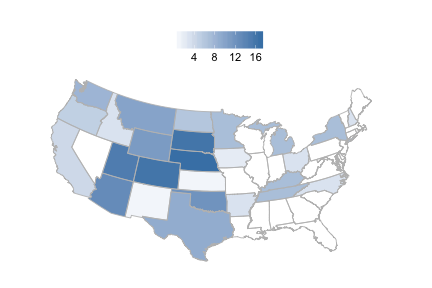
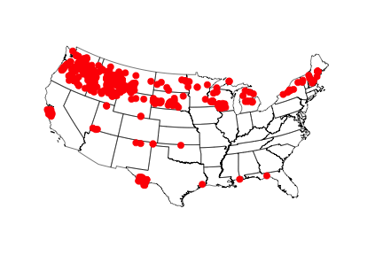
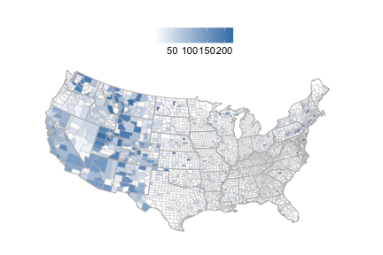

`rbison` is an R package to search and retrieve data from the USGS BISON service. `rbison` wraps R code around the BISON API to allow you to talk to the BISON database from R.

BISON has occurrence data for the US only.

BISON is a node of the Global Biodiversity Information Facility (GBIF) - i.e., you can get data that's available in BISON via GBIF instead if you want.

********************

### Info

See [http://bison.usgs.ornl.gov/doc/api.jsp](http://bison.usgs.ornl.gov/doc/api.jsp) for API docs for the BISON API.

********************

<section id="installation">

## Installation


```r
install.packages("rbison")
```

Or development version from GitHub


```r
install.packages("devtools")
devtools::install_github("ropensci/rbison")
```


```r
library("rbison")
```

<section id="usage">

## Usage

Notice that the function `bisonmap` automagically selects the map extent to plot for you, being one of the contiguous lower 48 states, or the lower 48 plus AK and HI, or a global map. If some or all points outside the US, a global map is drawn, and throws a warning. You may want to make sure the occurrence lat/long coordinates are correct.

## Get data


```r
out <- bison(species = "Helianthus annuus", count = 10)
```

Inspect summary


```r
out$summary
#>   total observation fossil specimen unknown living centroid
#> 1  6090         592    102     3946    1448      2        1
```

Map occurrences


```r
head(out$counties)
#>   record_id total      county_name         state
#> 1     20041     3 Dickinson County        Kansas
#> 2     54103     1    Wetzel County West Virginia
#> 3     40149     1   Washita County      Oklahoma
#> 4     54105     1      Wirt County West Virginia
#> 5     29025     1  Caldwell County      Missouri
#> 6     40143     2     Tulsa County      Oklahoma
```

## All points within the US (including AK and HI)

Get data


```r
out <- bison(species="Bison bison", count=600)
```

Inspect summary


```r
out$summary
#>   total observation fossil specimen unknown centroid
#> 1  1217         252    162      796       7        1
```

Map occurrences


```r
bisonmap(out, tomap="state")
```

 

## All points within the contiguous 48 states

Get data


```r
out <- bison(species="Aquila chrysaetos", count=600)
```

Inspect summary


```r
out$summary
#>   total observation fossil specimen unknown centroid
#> 1 84111       82185    102     1811      13        1
```

Map occurrences


```r
bisonmap(out, tomap="points")
```

 

## Plot county or state

With any data returned from a `bison` call, you can choose to plot county or state level data

Counties - using last data call for Aquila


```r
bisonmap(out, tomap="county")
```

 

States - using last data call for Aquila


```r
bisonmap(out, tomap="state")
```

 

## Constrain search with county IDs or bounding boxes

### Constrain search to a certain county.

Check out [this site](http://www.epa.gov/enviro/html/codes/state.html) to get state and county fips codes. Fips codes are like so: First two digits are the state code - last three are the county code. For example the *06* in  06037 is the state of California, and the *037* is the Los Angeles county.


```r
out <- bison(species="Helianthus annuus", countyFips = "06037")
```

Inspect summary


```r
out$summary
#>   total observation fossil specimen unknown living centroid
#> 1  6090         592    102     3946    1448      2        1
```

By default, the query only returned 10 records


```r
head(out$points)
#>                name decimalLongitude decimalLatitude occurrenceID
#> 1 Helianthus annuus        -97.05048        36.15451    924819078
#> 2 Helianthus annuus       -119.65502        36.76101   1022149513
#> 3 Helianthus annuus        -97.83139        27.40750     91592123
#> 4 Helianthus annuus       -105.21948        43.52802    891126339
#> 5 Helianthus annuus       -103.42134        43.60460    891030944
#> 6 Helianthus annuus       -100.87222        37.97167     91592528
#>                             provider       basis
#> 1           Emporia State University    Specimen
#> 2  Consortium of California Herbaria    Specimen
#> 3 US National Plant Germplasm System     Unknown
#> 4                    iNaturalist.org Observation
#> 5                    iNaturalist.org Observation
#> 6 US National Plant Germplasm System     Unknown
#>                                                     common_name geo
#> 1 common sunflower, annual sunflower, wild sunflower, sunflower Yes
#> 2 common sunflower, annual sunflower, wild sunflower, sunflower Yes
#> 3 common sunflower, annual sunflower, wild sunflower, sunflower Yes
#> 4 common sunflower, annual sunflower, wild sunflower, sunflower Yes
#> 5 common sunflower, annual sunflower, wild sunflower, sunflower Yes
#> 6 common sunflower, annual sunflower, wild sunflower, sunflower Yes
```

Or specify county by its actual name - probably much easier.


```r
out <- bison(species="Helianthus annuus", county = "Los Angeles")
```

Inspect summary


```r
out$summary
#>   total observation fossil specimen unknown centroid
#> 1   164          28      3      126       7        1
```

By default, the query only returned 10 records


```r
head(out$points)
#>                name decimalLongitude decimalLatitude occurrenceID
#> 1 Helianthus annuus        -118.1358        34.69806     40886950
#> 2 Helianthus annuus        -118.1358        34.69806     40886951
#> 3 Helianthus annuus        -118.1358        34.69806     40886952
#> 4 Helianthus annuus        -118.1358        34.69806     40886953
#> 5 Helianthus annuus        -118.8517        34.79611     40886954
#> 6 Helianthus annuus        -118.8517        34.79611     40886955
#>                             provider   basis
#> 1 US National Plant Germplasm System Unknown
#> 2 US National Plant Germplasm System Unknown
#> 3 US National Plant Germplasm System Unknown
#> 4 US National Plant Germplasm System Unknown
#> 5 US National Plant Germplasm System Unknown
#> 6 US National Plant Germplasm System Unknown
#>                                                     common_name geo
#> 1 common sunflower, annual sunflower, wild sunflower, sunflower Yes
#> 2 common sunflower, annual sunflower, wild sunflower, sunflower Yes
#> 3 common sunflower, annual sunflower, wild sunflower, sunflower Yes
#> 4 common sunflower, annual sunflower, wild sunflower, sunflower Yes
#> 5 common sunflower, annual sunflower, wild sunflower, sunflower Yes
#> 6 common sunflower, annual sunflower, wild sunflower, sunflower Yes
```

`bison` will help you if you spell the name wrong, or use a partial name. The results are not printed below, but you would get a prompt asking you to pick between the two counties that start with *Los*.


```r
bison(species="Helianthus annuus", county = "Los")
```

### Constrain search to a amorphous area.

Check out the Wikipedia page [here](http://en.wikipedia.org/wiki/Well-known_text) for an in depth look at the options, terminology, etc.


```r
out <- bison(species="Helianthus annuus", aoi = "POLYGON((-111.06360117772908 38.84001566645886,-110.80542246679359 39.37707771107983,-110.20117441992392 39.17722368276862,-110.20666758398464 38.90844075244811,-110.63513438085685 38.67724220095734,-111.06360117772908 38.84001566645886))")
```

Inspect summary


```r
out$summary
#>   total specimen centroid
#> 1     1        1        1
```

The data


```r
out$points
#>                name decimalLongitude decimalLatitude occurrenceID provider
#> 1 Helianthus annuus        -110.7211        39.00903  15613677160    BISON
#>      basis                                                   common_name
#> 1 Specimen common sunflower, annual sunflower, wild sunflower, sunflower
#>   geo
#> 1 Yes
```

### Constrain search to a certain aoibbox.

An aoibbox uses the format minx, miny, maxx, maxy.


```r
out <- bison(species="Helianthus annuus", aoibbox = '-120.31,35.81,-110.57,40.21')
```

Inspect summary


```r
out$summary
#>   total observation fossil specimen unknown centroid
#> 1   331          39      8      207      77        1
```

The data, by default, the query only returned 10 records


```r
head(out$points)
#>                name decimalLongitude decimalLatitude occurrenceID
#> 1 Helianthus annuus        -119.6550        36.76101   1022149513
#> 2 Helianthus annuus        -111.2217        38.11111     91592125
#> 3 Helianthus annuus        -110.6722        35.92778     40887980
#> 4 Helianthus annuus        -119.3464        36.20778     40892466
#> 5 Helianthus annuus        -119.7819        36.30083     40886962
#> 6 Helianthus annuus        -119.4192        36.35111     40892467
#>                             provider    basis
#> 1  Consortium of California Herbaria Specimen
#> 2 US National Plant Germplasm System  Unknown
#> 3 US National Plant Germplasm System  Unknown
#> 4 US National Plant Germplasm System  Unknown
#> 5 US National Plant Germplasm System  Unknown
#> 6 US National Plant Germplasm System  Unknown
#>                                                     common_name geo
#> 1 common sunflower, annual sunflower, wild sunflower, sunflower Yes
#> 2 common sunflower, annual sunflower, wild sunflower, sunflower Yes
#> 3 common sunflower, annual sunflower, wild sunflower, sunflower Yes
#> 4 common sunflower, annual sunflower, wild sunflower, sunflower Yes
#> 5 common sunflower, annual sunflower, wild sunflower, sunflower Yes
#> 6 common sunflower, annual sunflower, wild sunflower, sunflower Yes
```


<section id="citing">

## Citing

To cite `rbison` in publications use:

<br>

> Scott Chamberlain (2015). rbison: R interface to the USGS BISON API. R package version 0.4.8 http://CRAN.R-project.org/package=rbison

<section id="license_bugs">

## License and bugs

* License: [MIT](http://opensource.org/licenses/MIT)
* Report bugs at [our Github repo for rbison](https://github.com/ropensci/rbison/issues?state=open)

[Back to top](#top)
