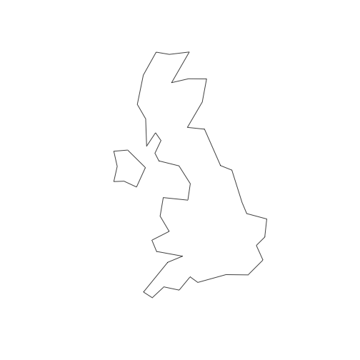
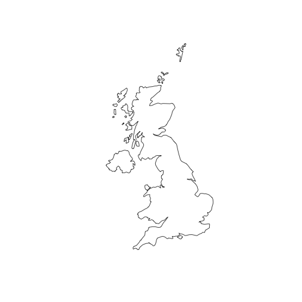
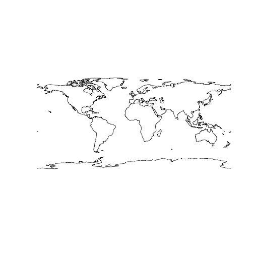

This vignette is an introduction to [rnaturalearth](https://github.com/ropenscilabs/rnaturalearth), an R package to hold and facilitate interaction with natural earth vector map data. `rnaturalearth` is a data package designed to provide map data that can be visualised using other R packages.

[Natural Earth](http://www.naturalearthdata.com/) is a public domain map dataset including vector country and other administrative boundaries.

[rnaturalearth](https://github.com/ropenscilabs/rnaturalearth) does two main things.

1. Contains pre-downloaded vector maps for :
    + countries `ne_countries()`
    + states `ne_states()`
    + coastline `ne_coastline()`

1. Has `ne_download()` function to facilitate download of other vector and raster maps.


This vignette uses `sp::plot` as a simple, quick way to show how different data can be accessed.`rnaturalearth` is designed to provide data allowing creation of more elaborate maps in other visualisation packages (e.g. `ggplot2`, `tmap` and `choroplethr`).


<section id="installation">

## Installation

Development version from GitHub


```r
if (!require("devtools")) install.packages("devtools")
devtools::install_github("ropenscilabs/rnaturalearth")
```


```r
library("rnaturalearth")
library("sp")
```

<section id="usage">

## Usage

### 1. Maps in the package.

Pre-downloaded maps can be accessed with :

1. `ne_countries()` for country (admin-0) boundaries
1. `ne_states()` for boundaries within countries (admin-1)
1. `ne_coastline()` for world coastline


World at small scale (low resolution)


```r
sp::plot(ne_countries(type = 'countries', scale = 'small'))
```


Countries, UK undivided


```r
sp::plot(ne_countries(country = 'united kingdom', type='countries'))
```



`map_units`, UK divided into England, Scotland, Wales and Northern Ireland


```r
sp::plot(ne_countries(country = 'united kingdom', type='map_units'))
```


Countries, small scale


```r
sp::plot(ne_countries(country = 'united kingdom', scale = 'small'))
```


Countries, medium scale


```r
sp::plot(ne_countries(country = 'united kingdom', scale = 'medium'))
```



Coastline of the world subsetting of coastline is not possible because the Natural Earth data are not attributed in that way


```r
sp::plot(ne_coastline())
```



### 2. Downloading other Natural Earth vectors with ne_download().

Each [Natural Earth](http://www.naturalearthdata.com/) dataset is characterised on the website according to `scale`, `type` and `category`. [rnaturalearth](https://github.com/ropenscilabs/rnaturalearth) allows you to specify `scale`, `type` and `category` and will construct the url and download the corresponding file.


```r

# lakes
lakes110 <- ne_download(scale = 110, type = 'lakes', category = 'physical')
sp::plot(lakes110, col = 'blue')

# rivers
rivers110 <- ne_download(scale = 110, type = 'rivers_lake_centerlines', category = 'physical')
sp::plot(rivers110, col = 'blue')
```

<section id="citing">

## Citing

> Andy South 2016. rnaturalearth: World Map Data from Natural Earth. R
  package version 0.0.0.9000. https://github.com/ropenscilabs/rnaturalearth


<section id="license_bugs">

## License and bugs

* License: [MIT](http://opensource.org/licenses/MIT)
* Report bugs at [our GitHub repo for rnaturalearth](https://github.com/ropenscilabs/rnaturalearth/issues?state=open)


[Back to top](#top)
