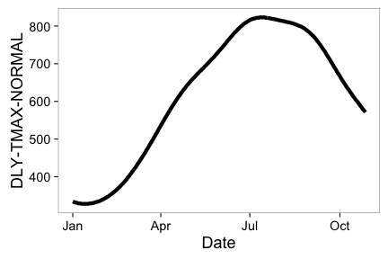
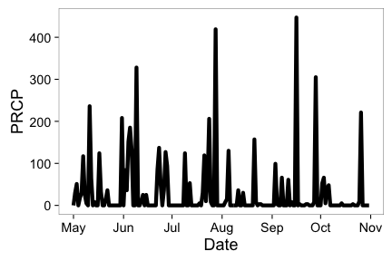
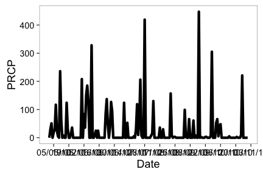
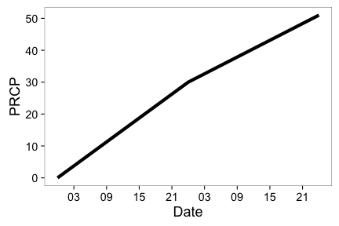
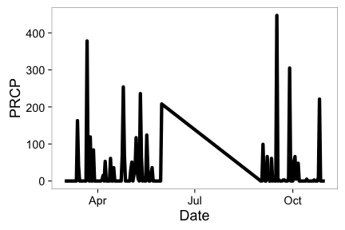
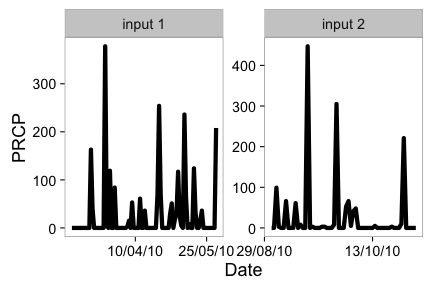
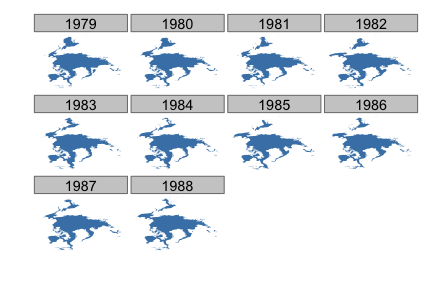

<section id="installation">

## Installation

Install and load `rnoaa` into the R session. Stable version from CRAN


```r
install.packages("rnoaa")
```

Or development version from Github:


```r
install.packages("devtools")
devtools::install_github("ropensci/rnoaa")
```


```r
library('rnoaa')
library('plyr')
```

<section id="usage">

## Usage

## National Climatic Data Center (NCDC) data

### Get info on a station by specifying a datasetid, locationid, and stationid


```r
ncdc_stations(datasetid='GHCND', locationid='FIPS:12017', stationid='GHCND:USC00084289')
```

```
## $meta
## NULL
## 
## $data
##   elevation    mindate    maxdate latitude                  name
## 1      12.2 1899-02-01 2015-06-17  28.8029 INVERNESS 3 SE, FL US
##   datacoverage                id elevationUnit longitude
## 1            1 GHCND:USC00084289        METERS  -82.3126
## 
## attr(,"class")
## [1] "ncdc_stations"
```

### Search for data and get a data.frame


```r
out <- ncdc(datasetid='NORMAL_DLY', datatypeid='dly-tmax-normal', startdate = '2010-05-01', enddate = '2010-05-10')
```

See a data.frame


```r
out$data
```

```
##                   date        datatype           station value fl_c
## 1  2010-05-01T00:00:00 DLY-TMAX-NORMAL GHCND:AQW00061705   869    C
## 2  2010-05-01T00:00:00 DLY-TMAX-NORMAL GHCND:CAW00064757   607    Q
## 3  2010-05-01T00:00:00 DLY-TMAX-NORMAL GHCND:CQC00914080   840    R
## 4  2010-05-01T00:00:00 DLY-TMAX-NORMAL GHCND:CQC00914801   858    R
## 5  2010-05-01T00:00:00 DLY-TMAX-NORMAL GHCND:FMC00914395   876    P
## 6  2010-05-01T00:00:00 DLY-TMAX-NORMAL GHCND:FMC00914419   885    P
## 7  2010-05-01T00:00:00 DLY-TMAX-NORMAL GHCND:FMC00914446   885    P
## 8  2010-05-01T00:00:00 DLY-TMAX-NORMAL GHCND:FMC00914482   868    R
## 9  2010-05-01T00:00:00 DLY-TMAX-NORMAL GHCND:FMC00914720   899    R
## 10 2010-05-01T00:00:00 DLY-TMAX-NORMAL GHCND:FMC00914761   897    P
## 11 2010-05-01T00:00:00 DLY-TMAX-NORMAL GHCND:FMC00914831   870    P
## 12 2010-05-01T00:00:00 DLY-TMAX-NORMAL GHCND:FMC00914892   883    P
## 13 2010-05-01T00:00:00 DLY-TMAX-NORMAL GHCND:FMC00914898   875    P
## 14 2010-05-01T00:00:00 DLY-TMAX-NORMAL GHCND:FMC00914911   885    P
## 15 2010-05-01T00:00:00 DLY-TMAX-NORMAL GHCND:FMW00040308   888    S
## 16 2010-05-01T00:00:00 DLY-TMAX-NORMAL GHCND:FMW00040504   879    C
## 17 2010-05-01T00:00:00 DLY-TMAX-NORMAL GHCND:FMW00040505   867    S
## 18 2010-05-01T00:00:00 DLY-TMAX-NORMAL GHCND:GQC00914025   852    P
## 19 2010-05-01T00:00:00 DLY-TMAX-NORMAL GHCND:GQW00041415   877    C
## 20 2010-05-01T00:00:00 DLY-TMAX-NORMAL GHCND:JQW00021603   852    P
## 21 2010-05-01T00:00:00 DLY-TMAX-NORMAL GHCND:PSC00914519   883    P
## 22 2010-05-01T00:00:00 DLY-TMAX-NORMAL GHCND:PSC00914712   840    P
## 23 2010-05-01T00:00:00 DLY-TMAX-NORMAL GHCND:PSW00040309   879    S
## 24 2010-05-01T00:00:00 DLY-TMAX-NORMAL GHCND:RMW00040604   867    S
## 25 2010-05-01T00:00:00 DLY-TMAX-NORMAL GHCND:RMW00040710   863    C
```

### Plot data, super simple, but it's a start


```r
out <- ncdc(datasetid='NORMAL_DLY', stationid='GHCND:USW00014895', datatypeid='dly-tmax-normal', startdate = '2010-01-01', enddate = '2010-12-10', limit = 300)
ncdc_plot(out)
```

 

Note that the x-axis tick text is not readable, but see futher down in tutorial for how to adjust that.

### More on plotting

#### Example 1

Search for data first, then plot


```r
out <- ncdc(datasetid='GHCND', stationid='GHCND:USW00014895', datatypeid='PRCP', startdate = '2010-05-01', enddate = '2010-10-31', limit=500)
```

Default plot


```r
ncdc_plot(out)
```

 

Create 14 day breaks


```r
ncdc_plot(out, breaks="14 days")
```

 

One month breaks


```r
ncdc_plot(out, breaks="1 month", dateformat="%d/%m")
```

 

#### Example 2

Search for data


```r
out2 <- ncdc(datasetid='GHCND', stationid='GHCND:USW00014895', datatypeid='PRCP', startdate = '2010-05-01', enddate = '2010-05-03', limit=100)
```

Make a plot, with 6 hour breaks, and date format with only hour


```r
ncdc_plot(out2, breaks="6 hours", dateformat="%H")
```

 

### Combine many calls to noaa function

Search for two sets of data


```r
out1 <- ncdc(datasetid='GHCND', stationid='GHCND:USW00014895', datatypeid='PRCP', startdate = '2010-03-01', enddate = '2010-05-31', limit=500)

out2 <- ncdc(datasetid='GHCND', stationid='GHCND:USW00014895', datatypeid='PRCP', startdate = '2010-09-01', enddate = '2010-10-31', limit=500)
```

Then combine with a call to `ncdc_combine`


```r
df <- ncdc_combine(out1, out2)
head(df[[1]]); tail(df[[1]])
```

```
##                  date datatype           station value fl_m fl_q fl_so
## 1 2010-03-01T00:00:00     PRCP GHCND:USW00014895     0    T          0
## 2 2010-03-02T00:00:00     PRCP GHCND:USW00014895     0    T          0
## 3 2010-03-03T00:00:00     PRCP GHCND:USW00014895     0    T          0
## 4 2010-03-04T00:00:00     PRCP GHCND:USW00014895     0               0
## 5 2010-03-05T00:00:00     PRCP GHCND:USW00014895     0               0
## 6 2010-03-06T00:00:00     PRCP GHCND:USW00014895     0               0
##   fl_t
## 1 2400
## 2 2400
## 3 2400
## 4 2400
## 5 2400
## 6 2400
```

```
##                    date datatype           station value fl_m fl_q fl_so
## 148 2010-10-26T00:00:00     PRCP GHCND:USW00014895   221               0
## 149 2010-10-27T00:00:00     PRCP GHCND:USW00014895     0               0
## 150 2010-10-28T00:00:00     PRCP GHCND:USW00014895     0    T          0
## 151 2010-10-29T00:00:00     PRCP GHCND:USW00014895     0    T          0
## 152 2010-10-30T00:00:00     PRCP GHCND:USW00014895     0               0
## 153 2010-10-31T00:00:00     PRCP GHCND:USW00014895     0               0
##     fl_t
## 148 2400
## 149 2400
## 150 2400
## 151 2400
## 152 2400
## 153 2400
```

Then plot - the default passing in the combined plot plots the data together. In this case it looks kind of weird since a straight line combines two distant dates.


```r
ncdc_plot(df)
```

 

But we can pass in each separately, which uses `facet_wrap` in `ggplot2` to plot each set of data in its own panel.


```r
ncdc_plot(out1, out2, breaks="45 days")
```

 

## ERDDAP data

> ERDDAP data is now avialable through the `rerddap` package


## Severe Weather Data Inventory (SWDI) data

### Search for nx3tvs data from 5 May 2006 to 6 May 2006


```r
swdi(dataset='nx3tvs', startdate='20060505', enddate='20060506')
```

```
## $meta
## $meta$totalCount
## numeric(0)
## 
## $meta$totalTimeInSeconds
## [1] 0.004
## 
## 
## $data
##                   ztime wsr_id cell_id cell_type range azimuth max_shear
## 1  2006-05-05T00:05:50Z   KBMX      Q0       TVS     7     217       403
## 2  2006-05-05T00:10:02Z   KBMX      Q0       TVS     5     208       421
## 3  2006-05-05T00:12:34Z   KSJT      P2       TVS    49     106        17
## 4  2006-05-05T00:17:31Z   KSJT      B4       TVS    40     297        25
## 5  2006-05-05T00:29:13Z   KMAF      H4       TVS    53     333        34
## 6  2006-05-05T00:31:25Z   KLBB      N0       TVS    51     241        24
## 7  2006-05-05T00:33:25Z   KMAF      H4       TVS    52     334        46
## 8  2006-05-05T00:37:37Z   KMAF      H4       TVS    50     334        34
## 9  2006-05-05T00:41:51Z   KMAF      H4       TVS    51     335        29
## 10 2006-05-05T00:44:33Z   KLBB      N0       TVS    46     245        35
## 11 2006-05-05T00:46:03Z   KMAF      H4       TVS    49     335        41
## 12 2006-05-05T00:48:55Z   KLBB      N0       TVS    44     246        44
## 13 2006-05-05T00:50:16Z   KMAF      H4       TVS    49     337        33
## 14 2006-05-05T00:54:29Z   KMAF      H4       TVS    47     337        42
## 15 2006-05-05T00:57:42Z   KLBB      N0       TVS    41     251        46
## 16 2006-05-05T00:58:41Z   KMAF      H4       TVS    46     340        29
## 17 2006-05-05T01:02:04Z   KLBB      N0       TVS    39     251        42
## 18 2006-05-05T01:02:53Z   KMAF      H4       TVS    46     339        35
## 19 2006-05-05T01:02:53Z   KMAF      H4       TVS    50     338        27
## 20 2006-05-05T01:06:26Z   KLBB      N0       TVS    36     251        31
## 21 2006-05-05T01:07:06Z   KMAF      F5       TVS    45     342        44
## 22 2006-05-05T01:10:48Z   KLBB      N0       TVS    36     256        37
## 23 2006-05-05T01:11:18Z   KMAF      F5       TVS    45     343        39
## 24 2006-05-05T01:15:30Z   KMAF      F5       TVS    44     344        30
## 25 2006-05-05T01:15:30Z   KMAF      H4       TVS    49     341        26
##    mxdv
## 1   116
## 2   120
## 3    52
## 4    62
## 5   111
## 6    78
## 7   145
## 8   107
## 9    91
## 10  100
## 11  127
## 12  121
## 13   98
## 14  126
## 15  117
## 16   85
## 17  102
## 18  101
## 19   84
## 20   70
## 21  120
## 22   83
## 23  108
## 24   78
## 25   81
## 
## $shape
##                                         shape
## 1  POINT (-86.8535716274277 33.0786326913943)
## 2  POINT (-86.8165772540846 33.0982820681588)
## 3  POINT (-99.5771091971025 31.1421609654838)
## 4   POINT (-101.188161700093 31.672392833416)
## 5  POINT (-102.664426480293 32.7306917937698)
## 6   POINT (-102.70047613441 33.2380072329615)
## 7    POINT (-102.6393683028 32.7226656893341)
## 8  POINT (-102.621904684258 32.6927081076156)
## 9   POINT (-102.614794815627 32.714139844846)
## 10 POINT (-102.643380529494 33.3266446067682)
## 11 POINT (-102.597961935071 32.6839260102062)
## 12 POINT (-102.613894688178 33.3526192273658)
## 13 POINT (-102.567153417051 32.6956373348052)
## 14  POINT (-102.551596970251 32.664939580306)
## 15 POINT (-102.586119971014 33.4287323151248)
## 16 POINT (-102.499638479193 32.6644438090742)
## 17   POINT (-102.5485490063 33.4398330734778)
## 18  POINT (-102.51446954228 32.6597119240996)
## 19 POINT (-102.559031583693 32.7166090376869)
## 20 POINT (-102.492174522228 33.4564626989719)
## 21 POINT (-102.463540844324 32.6573739036181)
## 22 POINT (-102.510349454162 33.5066366303981)
## 23 POINT (-102.448763863447 32.6613484943994)
## 24   POINT (-102.42842159557 32.649061124799)
## 25 POINT (-102.504158884526 32.7162751126854)
## 
## attr(,"class")
## [1] "swdi"
```

### Use an id


```r
out <- swdi(dataset='warn', startdate='20060506', enddate='20060507', id=533623)
list(out$meta, head(out$data), head(out$shape))
```

```
## [[1]]
## [[1]]$totalCount
## numeric(0)
## 
## [[1]]$totalTimeInSeconds
## [1] 0.098
## 
## 
## [[2]]
##            ztime_start            ztime_end     id         warningtype
## 1 2006-05-05T22:53:00Z 2006-05-06T00:00:00Z 397428 SEVERE THUNDERSTORM
## 2 2006-05-05T22:55:00Z 2006-05-06T00:00:00Z 397429 SEVERE THUNDERSTORM
## 3 2006-05-05T22:55:00Z 2006-05-06T00:00:00Z 397430 SEVERE THUNDERSTORM
## 4 2006-05-05T22:57:00Z 2006-05-06T00:00:00Z 397431 SEVERE THUNDERSTORM
## 5 2006-05-05T23:03:00Z 2006-05-06T00:00:00Z 397434 SEVERE THUNDERSTORM
## 6 2006-05-05T23:14:00Z 2006-05-06T00:15:00Z 397437 SEVERE THUNDERSTORM
##   issuewfo messageid
## 1     KLCH    052252
## 2     KLUB    052256
## 3     KLUB    052256
## 4     KMAF    052258
## 5     KMAF    052305
## 6     KLUB    052315
## 
## [[3]]
##                                                                                                                                                          shape
## 1                                                                             POLYGON ((-93.27 30.38, -93.29 30.18, -93.02 30.18, -93.04 30.37, -93.27 30.38))
## 2                                                                        POLYGON ((-101.93 34.74, -101.96 34.35, -101.48 34.42, -101.49 34.74, -101.93 34.74))
## 3                POLYGON ((-100.36 33.03, -99.99 33.3, -99.99 33.39, -100.28 33.39, -100.5 33.18, -100.51 33.02, -100.45 32.97, -100.37 33.03, -100.36 33.03))
## 4                                            POLYGON ((-102.8 30.74, -102.78 30.57, -102.15 30.61, -102.15 30.66, -101.92 30.68, -102.07 30.83, -102.8 30.74))
## 5                                                                        POLYGON ((-103.02 32.94, -103.03 32.66, -102.21 32.53, -102.22 32.95, -103.02 32.94))
## 6 POLYGON ((-101.6 33.32, -101.57 33.31, -101.57 33.51, -101.65 33.51, -101.66 33.5, -101.75 33.5, -101.77 33.49, -101.84 33.49, -101.84 33.32, -101.6 33.32))
```

### Get all 'plsr' within the bounding box (-91,30,-90,31)


```r
swdi(dataset='plsr', startdate='20060505', enddate='20060510', bbox=c(-91,30,-90,31))
```

```
## $meta
## $meta$totalCount
## numeric(0)
## 
## $meta$totalTimeInSeconds
## [1] 0.001
## 
## 
## $data
##                  ztime     id        event magnitude            city
## 1 2006-05-09T02:20:00Z 427540         HAIL         1    5 E KENTWOOD
## 2 2006-05-09T02:40:00Z 427536         HAIL         1    MOUNT HERMAN
## 3 2006-05-09T02:40:00Z 427537 TSTM WND DMG     -9999    MOUNT HERMAN
## 4 2006-05-09T03:00:00Z 427199         HAIL         0     FRANKLINTON
## 5 2006-05-09T03:17:00Z 427200      TORNADO     -9999 5 S FRANKLINTON
##       county state          source
## 1 TANGIPAHOA    LA TRAINED SPOTTER
## 2 WASHINGTON    LA TRAINED SPOTTER
## 3 WASHINGTON    LA TRAINED SPOTTER
## 4 WASHINGTON    LA   AMATEUR RADIO
## 5 WASHINGTON    LA LAW ENFORCEMENT
## 
## $shape
##                  shape
## 1 POINT (-90.43 30.93)
## 2  POINT (-90.3 30.96)
## 3  POINT (-90.3 30.96)
## 4 POINT (-90.14 30.85)
## 5 POINT (-90.14 30.78)
## 
## attr(,"class")
## [1] "swdi"
```


## Sea ice data

### Map all years for April only for North pole


```r
urls <- seaiceeurls(mo='Apr', pole='N')[1:10]
out <- lapply(urls, seaice)
names(out) <- seq(1979,1988,1)
df <- ldply(out)
library('ggplot2')
ggplot(df, aes(long, lat, group=group)) +
  geom_polygon(fill="steelblue") +
  theme_ice() +
  facet_wrap(~ .id)
```




## IBTrACS storm data

Get NOAA wind storm tabular data, metadata, or shp files from International Best Track Archive for Climate Stewardship (IBTrACS). See http://www.ncdc.noaa.gov/ibtracs/index.php?name=numbering for more.

### Metadata

There are two datasets stored in the package. By default `storm_meta()` gives metadata describing columns of the datasets returned.


```r
head( storm_meta() )
```

```
##   Column_number Column_name units Shapefile_pt_flag
## 1             1  Serial_Num   N/A                 1
## 2             2      Season  Year                 1
## 3             3         Num     #                 1
## 4             4       Basin    BB                 1
## 5             5   Sub_basin    BB                 1
## 6             6        Name   N/A                 1
##   Shapefile_pt_attribute_name shapefile_att_type shapefile_att_len
## 1                  Serial_Num                  7                13
## 2                      Season                  3                 4
## 3                         Num                  3                 5
## 4                       Basin                  7                 3
## 5                   Sub_basin                  7                 3
## 6                        Name                  7                57
##   shapefile_att_prc
## 1                 0
## 2                 0
## 3                 0
## 4                 0
## 5                 0
## 6                 0
```

Or you can get back a dataset of storm names, including storm ids and their names.


```r
head( storm_meta("storm_names") )
```

```
##              id                name
## 1 1842298N11080   NOT NAMED(td9636)
## 2 1845336N10074   NOT NAMED(td9636)
## 3 1848011S09079   NOT NAMED(td9636)
## 4 1848011S09080 XXXX848003(reunion)
## 5 1848011S15057 XXXX848002(reunion)
## 6 1848011S16057   NOT NAMED(td9636)
```

### Tabular data

You can get tabular data for basins, storms, or years, (or all data). `storm_data()` and the next function `storm_shp()` figure out what files to get, and gets them from an ftp server, and saves them to your machine. Do let us know if you have any problems with paths on your machine, and we'll fix 'em. The result from `storm_data()` is a `dplyr`-like data.frame with a easy summary that makes large datasets easy to view.

First, by basin (one of EP, NA, NI, SA, SI, SP, or WP)


```r
storm_data(year=1941)
#> <path>~/.rnoaa/storms/year/Year.1941.ibtracs_all.v03r06.csv
#>
#> <NOAA Storm Data>
#> Size: 1766 X 195
#>
#>       serial_num season num basin sub_basin      name            iso_time nature latitude
#> 1  1940215S18149   1941   1    SP        EA NOT NAMED 1940-08-01 12:00:00     NR     -999
#> 2  1940215S18149   1941   1    SP        EA NOT NAMED 1940-08-01 18:00:00     NR     -999
#> 3  1940215S18149   1941   1    SP        EA NOT NAMED 1940-08-02 00:00:00     NR     -999
#> 4  1940215S18149   1941   1    SP        EA NOT NAMED 1940-08-02 06:00:00     NR     -999
#> 5  1940215S18149   1941   1    SP        EA NOT NAMED 1940-08-02 12:00:00     NR     -999
#> 6  1940215S18149   1941   1    SP        EA NOT NAMED 1940-08-02 18:00:00     NR     -999
#> 7  1940215S18149   1941   1    SP        EA NOT NAMED 1940-08-03 00:00:00     NR     -999
#> 8  1940215S18149   1941   1    SP        EA NOT NAMED 1940-08-03 06:00:00     NR     -999
#> 9  1940215S18149   1941   1    SP        EA NOT NAMED 1940-08-03 12:00:00     NR     -999
#> 10 1940215S18149   1941   1    SP        EA NOT NAMED 1940-08-03 18:00:00     NR     -999
#> ..           ...    ... ...   ...       ...       ...                 ...    ...      ...
#> Variables not shown: longitude (dbl), wind.wmo. (dbl), pres.wmo. (dbl), center (chr),
#>      wind.wmo..percentile (dbl), pres.wmo..percentile (dbl), track_type (chr),
#>      latitude_for_mapping (dbl), longitude_for_mapping (dbl), current.basin (chr), hurdat_atl_lat
#>      (dbl), hurdat_atl_lon (dbl), hurdat_atl_grade (dbl), hurdat_atl_wind (dbl), hurdat_atl_pres
#>      (dbl), td9636_lat (dbl), td9636_lon (dbl), td9636_grade (dbl), td9636_wind (dbl),
```

## Buoy data

## Find out what buoys are available in a dataset


```r
head(buoys(dataset = "cwind"))
```

```
##      id
## 1 41001
## 2 41002
## 3 41004
## 4 41006
## 5 41008
## 6 41009
##                                                                       url
## 1 http://dods.ndbc.noaa.gov/thredds/catalog/data/cwind/41001/catalog.html
## 2 http://dods.ndbc.noaa.gov/thredds/catalog/data/cwind/41002/catalog.html
## 3 http://dods.ndbc.noaa.gov/thredds/catalog/data/cwind/41004/catalog.html
## 4 http://dods.ndbc.noaa.gov/thredds/catalog/data/cwind/41006/catalog.html
## 5 http://dods.ndbc.noaa.gov/thredds/catalog/data/cwind/41008/catalog.html
## 6 http://dods.ndbc.noaa.gov/thredds/catalog/data/cwind/41009/catalog.html
```

## Get buoy data

With `buoy` you can get data for a particular dataset, buoy id, year, and datatype. 

Get data for a buoy, specifying year and datatype


```r
buoy(dataset = 'cwind', buoyid = 41001, year = 2008, datatype = "cc")
```

```
## Dimensions (rows/cols): [1585 X 5] 
## 2 variables: [wind_dir, wind_spd] 
## 
##                    time latitude longitude wind_dir wind_spd
## 1  2008-05-28T16:00:00Z   34.704   -72.734      230      8.6
## 2  2008-05-28T16:10:00Z   34.704   -72.734      230      8.7
## 3  2008-05-28T16:20:00Z   34.704   -72.734      229      8.5
## 4  2008-05-28T16:30:00Z   34.704   -72.734      231      8.8
## 5  2008-05-28T16:40:00Z   34.704   -72.734      236      8.5
## 6  2008-05-28T16:50:00Z   34.704   -72.734      235      8.9
## 7  2008-05-28T17:00:00Z   34.704   -72.734      233      8.2
## 8  2008-05-28T17:10:00Z   34.704   -72.734      233      8.2
## 9  2008-05-28T17:20:00Z   34.704   -72.734      231      8.3
## 10 2008-05-28T17:30:00Z   34.704   -72.734      232      7.8
## ..                  ...      ...       ...      ...      ...
```


## More data

There are more NOAA data sources in `noaa`. Check out the various vignettes in the package. 

<section id="citing">

## Citing

To cite `rnoaa` in publications use:

<br>

> Scott Chamberlain, Hart Edmund, and Karthik Ram (2015). rnoaa: NOAA climate data from R. R package version 0.4.0. https://github.com/ropensci/rnoaa

<section id="license_bugs">

## License and bugs

* License: [MIT](http://opensource.org/licenses/MIT)
* Report bugs at [our Github repo for rnoaa](https://github.com/ropensci/rnoaa/issues?state=open)

[Back to top](#top)
