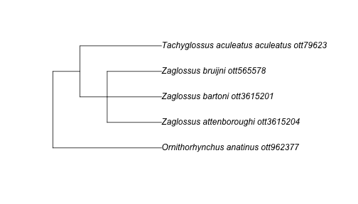

`rotl` provides an interface to the Open Tree of Life (OTL) API and allows users
to query the API, retrieve parts of the Tree of Life and integrate these parts
with other R packages.

The OTL API provides services to access:

* the **Tree of Life** a.k.a. TOL (the synthetic tree): a single draft tree that is
  a combination of **the OTL taxonomy** and the **source trees** (studies)
* the **Taxonomic name resolution services** a.k.a. TNRS: the methods for
  resolving taxonomic names to the internal identifiers used by the TOL and the
  GOL (the `ott ids`).
* the **Taxonomy** a.k.a. OTT (for Open Tree Taxonomy): which represents the
  synthesis of the different taxonomies used as a backbone of the TOL when no
  studies are available.
* the **Studies** containing the source trees used to build the TOL, and
  extracted from the scientific literature.

In `rotl`, each of these services correspond to functions with different
prefixes:

| Service       | `rotl` prefix |
|---------------|---------------|
| Tree of Life  | `tol_`        |
| TNRS          | `tnrs_`       |
| Taxonomy      | `taxonomy_`   |
| Studies       | `studies_`    |

`rotl` also provides a few other functions and methods that can be used to
extract relevant information from the objects returned by these functions.


<section id="installation">

## Installation


```r
install.packages("rotl")
```

Or development version from GitHub


```r
install.packages("devtools")
devtools::install_github("ropensci/rotl")
```


```r
library("rotl")
```

<section id="usage">

## Usage

### Demonstration of a basic workflow

The most common use for `rotl` is probably to start from a list of species and
get the relevant parts of the tree for these species. This is a two step
process:

1. the species names need to be matched to their `ott_id` (the Open Tree
	Taxonomy identifiers) using the Taxonomic name resolution services (TNRS)
1. these `ott_id` will then be used to retrieve the relevant parts of the Tree
   of Life.

#### Step 1: Matching taxonomy to the `ott_id`

Let's start by doing a search on a diverse group of taxa: a tree frog (genus
_Hyla_), a fish (genus _Salmo_), a sea urchin (genus _Diadema_), and a nautilus
(genus _Nautilus_).


```r
taxa <- c("Hyla", "Salmo", "Diadema", "Nautilus")
resolved_names <- tnrs_match_names(taxa)
```

It's always a good idea to check that the resolved names match what you
intended:


|search_string |unique_name                |approximate_match |ott_id  |is_synonym |flags |number_matches |
|:-------------|:--------------------------|:-----------------|:-------|:----------|:-----|:--------------|
|hyla          |Hyla                       |FALSE             |1062216 |FALSE      |      |1              |
|salmo         |Salmo                      |FALSE             |982359  |FALSE      |      |1              |
|diadema       |Diadema (genus in Holozoa) |FALSE             |631176  |FALSE      |      |2              |
|nautilus      |Nautilus                   |FALSE             |616358  |FALSE      |      |1              |


The column `unique_name` sometimes indicates the higher taxonomic level
associated with the name. The column `number_matches` indicates the number of
`ott_id` that corresponds to a given name. In this example, our search on
_Diadema_ returns 2 matches, and the one returned by default is indeed the sea
urchin that we want for our query. The argument `context_name` allows you to
limit the taxonomic scope of your search. _Diadema_ is also the genus name of a
fungus. To ensure that our search is limited to animal names, we could do:


```r
resolved_names <- tnrs_match_names(taxa, context_name = "Animals")
```

If you are trying to build a tree with deeply divergent taxa that the argument
`context_name` cannot fix, see "How to change the ott ids assigned to my taxa?"
in the FAQ below.


#### Step 2: Getting the tree corresponding to our taxa

Now that we have the correct `ott_id` for our taxa, we can ask for the tree
using the `tol_induced_subtree()` function. By default, the object returned by
`tol_induced_subtree` is a phylo object (from the
[ape](http://cran.r-project.org/package=ape) package), so we can plot it
directly.


```r
my_tree <- tol_induced_subtree(ott_ids = resolved_names$ott_id)
plot(my_tree, no.margin=TRUE)
```


### Get tree for a particular taxonomic group

If you are looking to get the tree for a particular taxonomic group, you need to
first identify it by its node id or ott id, and then use the `tol_subtree()`
function:


```r
mono_id <- tnrs_match_names("Monotremes")
mono_tree <- tol_subtree(ott_id = mono_id$ott_id[1])
plot(mono_tree)
```




### Find trees from studies focused on my favourite taxa

The function `studies_find_trees()` allows the user to search for studies
matching a specific criteria. The function `studies_properties()` returns the
list of properties that can be used in the search.


```r
furry_studies <- studies_find_studies(property="ot:focalCladeOTTTaxonName", value="Mammalia")
furry_ids <- furry_studies$study_ids
```

Now that we know the `study_id`, we can ask for the meta data information
associated with this study:


```r
furry_meta <- get_study_meta("pg_2550")
get_publication(furry_meta)     ## The citation for the source of the study
#> [1] "O'Leary, Maureen A., Marc Allard, Michael J. Novacek, Jin Meng, and John Gatesy. 2004. \"Building the mammalian sector of the tree of life: Combining different data and a discussion of divergence times for placental mammals.\" In: Cracraft J., & Donoghue M., eds. Assembling the Tree of Life. pp. 490-516. Oxford, United Kingdom, Oxford University Press."
#> attr(,"DOI")
#> [1] ""
get_tree_ids(furry_meta)        ## This study has 10 trees associated with it
#>  [1] "tree5513" "tree5515" "tree5516" "tree5517" "tree5518" "tree5519"
#>  [7] "tree5520" "tree5521" "tree5522" "tree5523"
candidate_for_synth(furry_meta) ## None of these trees are yet included in the OTL
#> NULL
```

Using `get_study("pg_2550")` would returns a `multiPhylo` object (default) with
all the trees associated with this particular study, while
`get_study_tree("pg_2550", "tree5513")` would return one of these trees.


<section id="citing">

## Citing

To cite `rotl` in publications use:

<br>

> Francois Michonneau, Joseph Brown and David Winter (2016). rotl: Interface to the 'Open Tree of
  Life' API. R package version 3.0.0. https://cran.rstudio.com/package=rotl

<section id="license_bugs">

## License and bugs

* License: [BSD_2_clause](https://opensource.org/licenses/BSD-2-Clause)
* Report bugs at [our Github repo for rotl](https://github.com/ropensci/rotl/issues?state=open)

[Back to top](#top)
