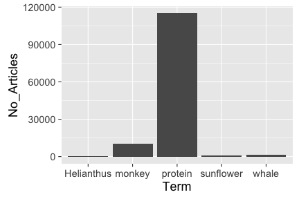
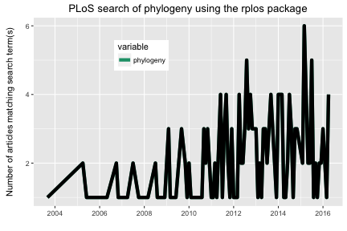
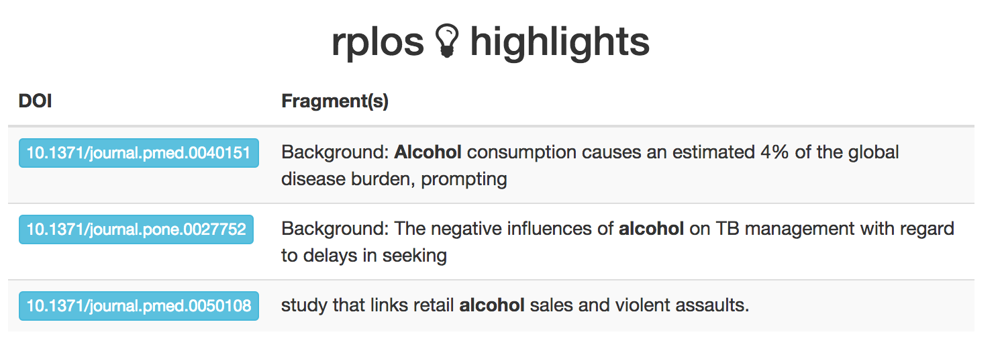

The `rplos` package interacts with the API services of [PLoS](http://www.plos.org/) (Public Library of Science) Journals. You used to need an API key to work with this package - that is no longer needed!

This tutorial will go through three use cases to demonstrate the kinds
of things possible in `rplos`.

* Search across PLoS papers in various sections of papers
* Search for terms and visualize results as a histogram OR as a plot through time
* Text mining of scientific literature

<section id="installation">

## Installation


```r
install.packages("rplos")
```

Or development version


```r
if (!require("devtools")) install.packages("devtools")
devtools::install_github("ropensci/rplos")
```


```r
library("rplos")
```

<section id="usage">

## Usage

### Search across PLoS papers in various sections of papers

`searchplos` is a general search, and in this case searches for the term
**Helianthus** and returns the DOI's of matching papers


```r
searchplos(q= "Helianthus", fl= "id", limit = 5)
```

```
#> $meta
#>   numFound start maxScore
#> 1      422     0       NA
#> 
#> $data
#>                             id
#> 1 10.1371/journal.pone.0148280
#> 2 10.1371/journal.pone.0111982
#> 3 10.1371/journal.pone.0057533
#> 4 10.1371/journal.pone.0139188
#> 5 10.1371/journal.pone.0045899
```

Get only full article DOIs


```r
searchplos(q="*:*", fl='id', fq='doc_type:full', start=0, limit=5)
```

```
#> $meta
#>   numFound start maxScore
#> 1   184983     0       NA
#> 
#> $data
#>                                                        id
#> 1                            10.1371/journal.pone.0107420
#> 2 10.1371/annotation/492fdf80-c999-4947-b569-96af8cb4e9d9
#> 3 10.1371/annotation/7a3d2279-0f96-433c-bb3f-d7fda1759633
#> 4 10.1371/annotation/78d328b9-2c8c-4978-84b1-7e6a0b12ada1
#> 5 10.1371/annotation/7983e1b9-09e4-4123-b1d5-aaaa0121e76a
```

Get DOIs for only PLoS One articles


```r
searchplos(q="*:*", fl='id', fq='cross_published_journal_key:PLoSONE', start=0, limit=5)
```

```
#> $meta
#>   numFound start maxScore
#> 1  1344674     0       NA
#> 
#> $data
#>                                        id
#> 1            10.1371/journal.pone.0107420
#> 2      10.1371/journal.pone.0107420/title
#> 3   10.1371/journal.pone.0107420/abstract
#> 4 10.1371/journal.pone.0107420/references
#> 5       10.1371/journal.pone.0107420/body
```

Get DOIs for full article in PLoS One


```r
searchplos(q="*:*", fl='id',
   fq=list('cross_published_journal_key:PLoSONE', 'doc_type:full'),
   start=0, limit=5)
```

```
#> $meta
#>   numFound start maxScore
#> 1   157139     0       NA
#> 
#> $data
#>                                                        id
#> 1                            10.1371/journal.pone.0107420
#> 2 10.1371/annotation/492fdf80-c999-4947-b569-96af8cb4e9d9
#> 3 10.1371/annotation/7a3d2279-0f96-433c-bb3f-d7fda1759633
#> 4 10.1371/annotation/78d328b9-2c8c-4978-84b1-7e6a0b12ada1
#> 5 10.1371/annotation/7983e1b9-09e4-4123-b1d5-aaaa0121e76a
```

Search for many terms


```r
q <- c('ecology','evolution','science')
lapply(q, function(x) searchplos(x, limit=2))
```

```
#> [[1]]
#> [[1]]$meta
#>   numFound start maxScore
#> 1    32852     0       NA
#> 
#> [[1]]$data
#>                             id
#> 1 10.1371/journal.pone.0059813
#> 2 10.1371/journal.pone.0001248
#> 
#> 
#> [[2]]
#> [[2]]$meta
#>   numFound start maxScore
#> 1    53560     0       NA
#> 
#> [[2]]$data
#>                                                        id
#> 1 10.1371/annotation/9773af53-a076-4946-a3f1-83914226c10d
#> 2 10.1371/annotation/c55d5089-ba2f-449d-8696-2bc8395978db
#> 
#> 
#> [[3]]
#> [[3]]$meta
#>   numFound start maxScore
#> 1   157210     0       NA
#> 
#> [[3]]$data
#>                             id
#> 1 10.1371/journal.pbio.0020122
#> 2 10.1371/journal.pbio.1001166
```

### Search on specific sections

A suite of functions were created as light wrappers around `searchplos` as a shorthand to search specific sections of a paper.

* `plosauthor` searchers in authors
* `plosabstract` searches in abstracts
* `plostitle` searches in titles
* `plosfigtabcaps` searches in figure and table captions
* `plossubject` searches in subject areas

`plosauthor` searches across authors, and in this case returns the authors of the matching papers. the fl parameter determines what is returned


```r
plosauthor(q = "Eisen", fl = "author", limit = 5)
```

```
#> $meta
#>   numFound start maxScore
#> 1      833     0       NA
#> 
#> $data
#>             author
#> 1 Jonathan A Eisen
#> 2 Jonathan A Eisen
#> 3 Jonathan A Eisen
#> 4 Jonathan A Eisen
#> 5 Jonathan A Eisen
```

`plosabstract` searches across abstracts, and in this case returns the id and title of the matching papers


```r
plosabstract(q = 'drosophila', fl='id,title', limit = 5)
```

```
#> $meta
#>   numFound start maxScore
#> 1     2925     0       NA
#> 
#> $data
#>                             id
#> 1 10.1371/journal.pbio.0040198
#> 2 10.1371/journal.pbio.0030246
#> 3 10.1371/journal.pone.0012421
#> 4 10.1371/journal.pbio.0030389
#> 5 10.1371/journal.pone.0002817
#>                                                                             title
#> 1                                                                     All for All
#> 2                                     School Students as Drosophila Experimenters
#> 3                            Host Range and Specificity of the Drosophila C Virus
#> 4                     New Environments Set the Stage for Changing Tastes in Mates
#> 5 High-Resolution, In Vivo Magnetic Resonance Imaging of Drosophila at 18.8 Tesla
```

`plostitle` searches across titles, and in this case returns the title and journal of the matching papers


```r
plostitle(q='drosophila', fl='title,journal', limit=5)
```

```
#> $meta
#>   numFound start maxScore
#> 1     1892     0       NA
#> 
#> $data
#>                      journal
#> 1               PLoS Biology
#> 2               PLoS Biology
#> 3              PLoS Genetics
#> 4 PLoS Computational Biology
#> 5                   PLoS ONE
#>                                                   title
#> 1      Reinforcement of Gametic Isolation in Drosophila
#> 2         Identification of Drosophila MicroRNA Targets
#> 3 Phenotypic Plasticity of the Drosophila Transcriptome
#> 4            Parametric Alignment of Drosophila Genomes
#> 5              A Tripartite Synapse Model in Drosophila
```

### Search for terms and visualize results as a histogram OR as a plot through time

`plosword` allows you to search for 1 to K words and visualize the results
as a histogram, comparing number of matching papers for each word


```r
out <- plosword(list("monkey", "Helianthus", "sunflower", "protein", "whale"),
    vis = "TRUE")
out$table
```

```
#>   No_Articles       Term
#> 1       10289     monkey
#> 2         422 Helianthus
#> 3        1144  sunflower
#> 4      114997    protein
#> 5        1331      whale
```


```r
out$plot
```



You can also pass in curl options, in this case get verbose information on the curl call.


```r
plosword('Helianthus', callopts=list(verbose=TRUE))
```

```
#> Number of articles with search term 
#>                                 422
```

### Visualize terms

`plot_throughtime` allows you to search for up to 2 words and visualize the results as a line plot through time, comparing number of articles matching through time. Visualize with the ggplot2 package, only up to two terms for now.


```r
library("ggplot2")
plot_throughtime(terms = "phylogeny", limit = 200) + geom_line(size=2, color='black')
```



### Faceted search

In addition to `searchplos()` and related searching functions, there are a few slightly different ways to search: faceting and highlighted searches. Faceting allows you to ask, e.g., how many articles are published in each of the PLOS journals. Highlighting allows you to ask, e.g., highlight terms that I search for in the text results given back, which can make downstream processing easier, and help visualize search results (see `highbrow()` below).

Facet by journal


```r
facetplos(q='*:*', facet.field='journal')
```

```
#> $facet_queries
#> NULL
#> 
#> $facet_fields
#> $facet_fields$journal
#>                                 X1      X2
#> 1                         plos one 1285831
#> 2                    plos genetics   50706
#> 3                   plos pathogens   44134
#> 4       plos computational biology   37646
#> 5 plos neglected tropical diseases   35979
#> 6                     plos biology   29392
#> 7                    plos medicine   20335
#> 8             plos clinical trials     521
#> 9                     plos medicin       9
#> 
#> 
#> $facet_dates
#> NULL
#> 
#> $facet_ranges
#> NULL
```

Using `facet.query` to get counts


```r
facetplos(q='*:*', facet.field='journal', facet.query='cell,bird')
```

```
#> $facet_queries
#>        term value
#> 1 cell,bird    24
#> 
#> $facet_fields
#> $facet_fields$journal
#>                                 X1      X2
#> 1                         plos one 1285831
#> 2                    plos genetics   50706
#> 3                   plos pathogens   44134
#> 4       plos computational biology   37646
#> 5 plos neglected tropical diseases   35979
#> 6                     plos biology   29392
#> 7                    plos medicine   20335
#> 8             plos clinical trials     521
#> 9                     plos medicin       9
#> 
#> 
#> $facet_dates
#> NULL
#> 
#> $facet_ranges
#> NULL
```

Date faceting


```r
facetplos(q='*:*', url=url, facet.date='publication_date',
  facet.date.start='NOW/DAY-5DAYS', facet.date.end='NOW', facet.date.gap='+1DAY')
```

```
#> $facet_queries
#> NULL
#> 
#> $facet_fields
#> NULL
#> 
#> $facet_dates
#> $facet_dates$publication_date
#>                   date value
#> 1 2016-04-27T00:00:00Z  2247
#> 2 2016-04-28T00:00:00Z  2187
#> 3 2016-04-29T00:00:00Z   848
#> 4 2016-04-30T00:00:00Z     0
#> 5 2016-05-01T00:00:00Z     0
#> 6 2016-05-02T00:00:00Z     0
#> 
#> 
#> $facet_ranges
#> NULL
```

### Highlighted search

Search for the term _alcohol_ in the abstracts of articles, return only 10 results


```r
highplos(q='alcohol', hl.fl = 'abstract', rows=2)
```

```
#> $`10.1371/journal.pmed.0040151`
#> $`10.1371/journal.pmed.0040151`$abstract
#> [1] "Background: <em>Alcohol</em> consumption causes an estimated 4% of the global disease burden, prompting"
#> 
#> 
#> $`10.1371/journal.pone.0027752`
#> $`10.1371/journal.pone.0027752`$abstract
#> [1] "Background: The negative influences of <em>alcohol</em> on TB management with regard to delays in seeking"
```

Search for the term _alcohol_ in the abstracts of articles, and return fragment size of 20 characters, return only 5 results


```r
highplos(q='alcohol', hl.fl='abstract', hl.fragsize=20, rows=2)
```

```
#> $`10.1371/journal.pmed.0040151`
#> $`10.1371/journal.pmed.0040151`$abstract
#> [1] "Background: <em>Alcohol</em>"
#> 
#> 
#> $`10.1371/journal.pone.0027752`
#> $`10.1371/journal.pone.0027752`$abstract
#> [1] " of <em>alcohol</em> on TB management"
```

Search for the term _experiment_ across all sections of an article, return id (DOI) and title fl only, search in full articles only (via `fq='doc_type:full'`), and return only 10 results


```r
highplos(q='everything:"experiment"', fl='id,title', fq='doc_type:full',
   rows=2)
```

```
#> $`10.1371/journal.pone.0154334`
#> $`10.1371/journal.pone.0154334`$everything
#> [1] " and designed the <em>experiments</em>: RJ CM AOC. Performed the <em>experiments</em>: RJ AOC. Analyzed the data: RJ. Contributed"
#> 
#> 
#> $`10.1371/journal.pone.0039681`
#> $`10.1371/journal.pone.0039681`$everything
#> [1] " Selection of Transcriptomics <em>Experiments</em> Improves Guilt-by-Association Analyses Transcriptomics <em>Experiment</em>"
```

### Visualize highligted searches

Browse highlighted fragments in your default browser

This first examle, we only looko at 10 results


```r
out <- highplos(q='alcohol', hl.fl = 'abstract', rows=10)
highbrow(out)
```



But it works quickly with lots of results too


```r
out <- highplos(q='alcohol', hl.fl = 'abstract', rows=1200)
highbrow(out)
```


<section id="citing">

## Citing

To cite `rplos` in publications use:

<br>

> Scott Chamberlain, Carl Boettiger and Karthik Ram (2016). rplos: Interface to PLOS Journals search API. R package version 0.5.6 https://github.com/ropensci/rplos

<section id="license_bugs">

## License and bugs

* License: [MIT](http://opensource.org/licenses/MIT)
* Report bugs at [our Github repo for rplos](https://github.com/ropensci/rplos/issues?state=open)

[Back to top](#top)
